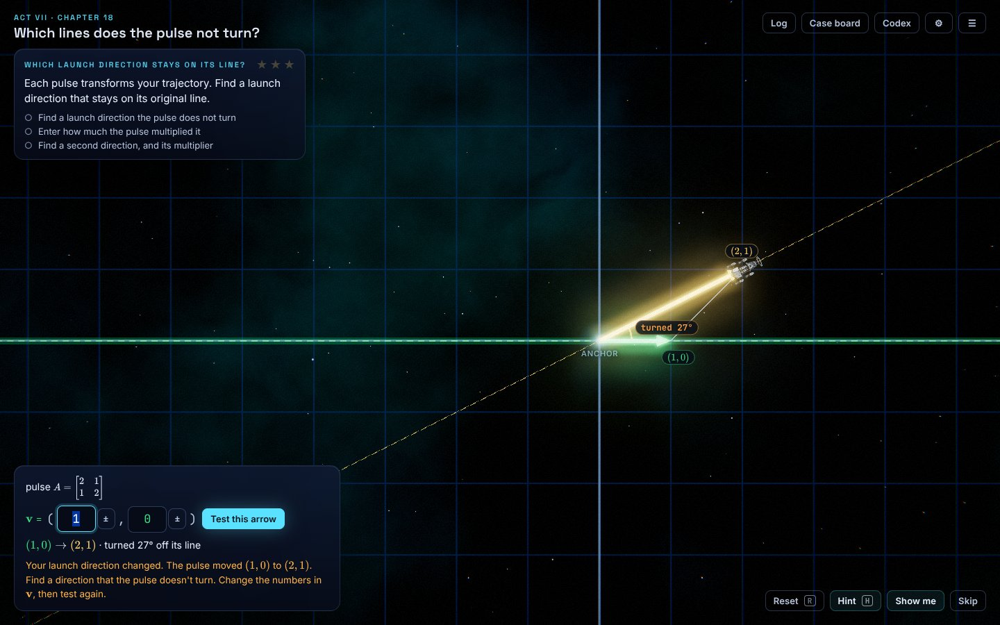
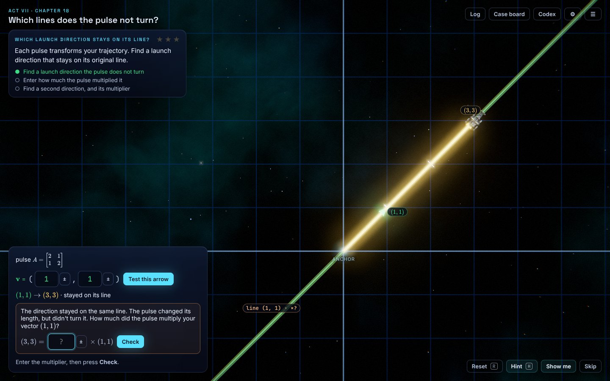
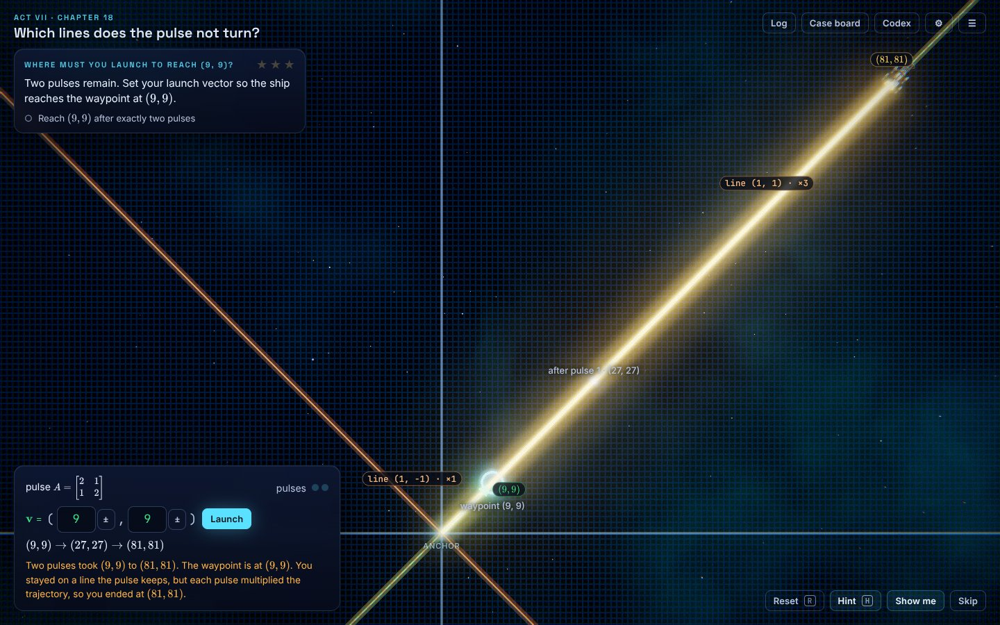
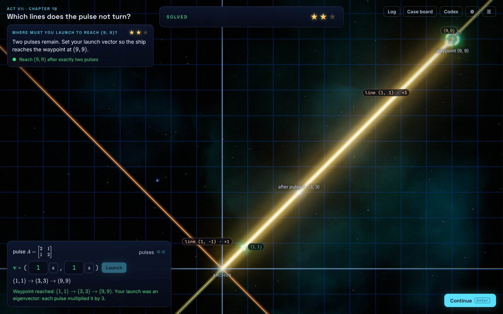
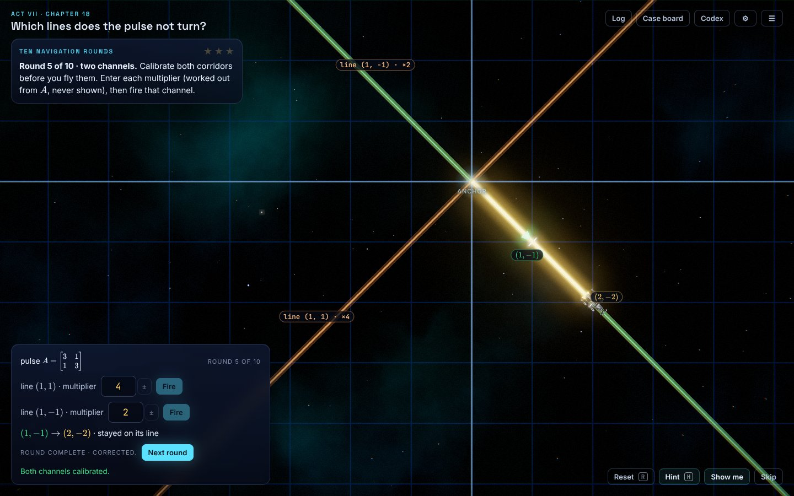
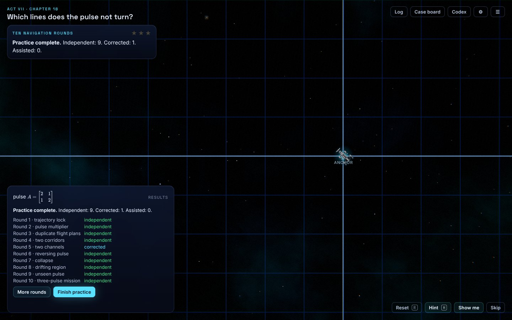

# Chapter 18 trajectory rebuild: status for review

As of 2026-10-08. Code at commit `5c5a7b2` on branch `claude/ch18-trajectory-preview`.

---

## Where the work lives

| What | Where |
|---|---|
| Spec (the brief being implemented) | `game-design/ch18-trajectory-spec.md` |
| How it is built (beat order, files, rules) | `game-design/ch18-trajectory-build.md` |
| This status note and screenshots | `game-design/ch18-preview-status.md`, `game-design/ch18-preview-shots/` |
| Code | `site/src/game/content/chapters/c18-eigen/traj*.ts`, `drill.ts`, `traj.css` |
| Engine hooks (small, additive) | `site/src/game/game/types.ts`, `runner.ts`, `audio/sfx.ts`, `core/save.ts` |
| Tests | `tests/unit/game-c18-traj.test.ts`, `tests/unit/game-c18-traj-text.test.ts` |
| Playable preview | Private claude.ai artifact `S2oVbVPeeUs6cDgLw2ENLC`, built from `5c5a7b2` (owner access only) |

- The production SINGULAR artifact has not been republished. It still runs the old Chapter 18.
- Nothing deploys from this repo automatically (GitHub Pages runs only on a `main` branch, which does not exist).

---

## What is playable

| Spec | Puzzle (beat) | What the player does |
|---|---|---|
| Scenes 1–3 | `c18-p1` (3) | Failed launch → first kept line → its multiplier → second line → its multiplier → showcase |
| Name card | (4) | "eigenvector" and "eigenvalue" named, quoting the player's own vectors |
| Scene 4 | `c18-m1` (5) | Reach (9, 9) after exactly two pulses |
| Scene 5 | `c18-drill` (6) | Ten rounds, results screen, extra rounds on demand |
| Scene 6 | `c18-solo` (7) | Unfamiliar pulse, reach (32, 16) after two pulses; summary and flight log |

The rest of Chapter 18 (beat 8 on) is unchanged.

**Reaching it in the preview**

1. Title screen → **Settings** → Difficulty **Commander** (default is Navigator).
2. **Chapter map** → **Chapter 18** → **Jump to a part** → "Which launch direction stays on its line?"

---

## Evidence

**On `5c5a7b2` (this code)**

- Build and package: done.
- Packaged build loads straight into the first encounter.
- One scripted Commander playthrough, desktop 1440×900: Scenes 1–6 all won, carried on into the rest of the chapter, no console errors.

**On `e1bde50` (previous commit)**

- Unit tests 635/635. Solver harness 10/10 on Commander. Desktop and phone playthroughs, no console errors.

**Not run on `5c5a7b2`**

- Unit tests (the new tests in this commit have not been run).
- Phone-size playthrough.
- Solver harness across all chapters and difficulties.
- Review workflows (paused at the owner's request).
- Report against the spec's 22 acceptance criteria (not written).

---

## Screenshots (Commander, desktop, commit `5c5a7b2`)

1. **Failed launch** — (1, 0) is sent to (2, 1). Green launch line, yellow result, "turned 27°" tag, the spec's own sentence.
   
2. **Kept direction found** — (1, 1) comes back as (3, 3). The line is tagged "×?" until the player types the multiplier.
   
3. **Two-pulse miss** — launching at the target (9, 9) ends at (81, 81); the message explains each pulse multiplied the trajectory.
   
4. **Two-pulse hit** — (1, 1) → (3, 3) → (9, 9).
   
5. **Practice round 5** — two kept lines; the player enters each multiplier, then fires that line.
   
6. **Practice results** — ten rounds, each marked independent, corrected or assisted.
   

---

## Known issues

- Scenes 4 and 6 can also be solved as a plain 2 × 2 linear system, without using the kept lines.
- Round 8's shear repeats the later shear puzzle (`c18-p2`).
- The new dialogue lines have no voice audio.
- Some labels overlap (for example "after pulse 1" under a dot); the grid looks dense after large pulses.
- The yellow glow is heavy; the collapse round leaves nothing on screen after its animation.
- The Scene 6 summary puts a lot of text in one panel.
- Old saves may keep stars from the old `c18-p1`.
