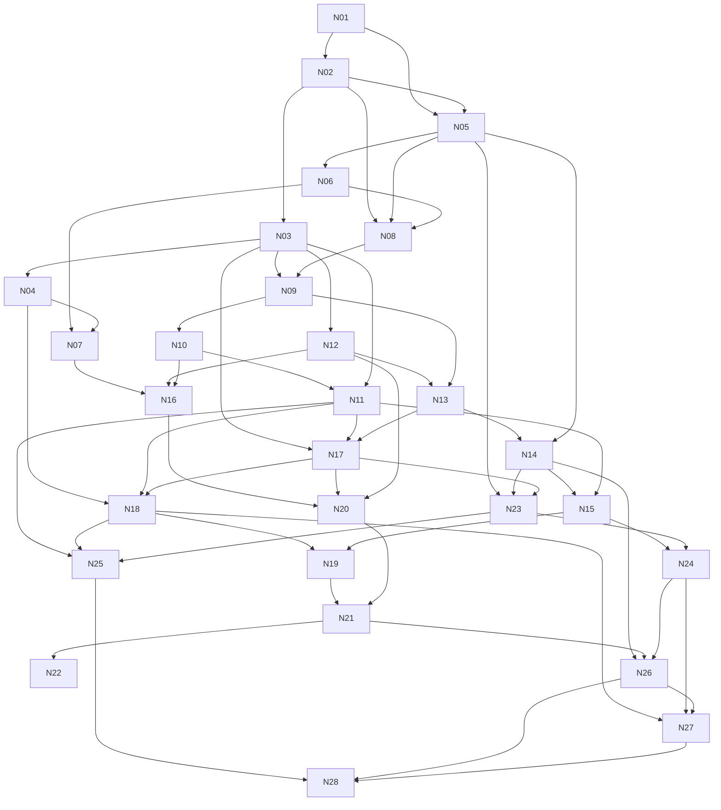

# Curriculum: the linear algebra concept map

Owner: curriculum architect. Status: definitive concept map for the game.
Scope: a full university first course (MIT 18.06, Lay chapters 1–7, Monash MTH1030 / ENG1005 linear algebra) plus the second-course ideas a Master of AI student needs (spectral theorem, quadratic forms, positive definite matrices, SVD, low-rank approximation, PCA).

Every content writer reads sections 0 and 3 before writing any node. Section 2 is the reference for each level.

---

## 0. How to use this file

### 0.1 Node template

Each node has the fields the brief asks for, plus two that content writers need:

| Field | What it holds |
|---|---|
| **Q** | The plain question the node answers. The level opens with this problem, never with a definition. |
| **See it** | The literal picture: what the learner watches happen on screen. This is the aha. |
| **Where the formula comes from** | A 2–4 line derivation idea, so the formula is rebuilt, not memorised. |
| **By hand** | The exam skills. The game's "Officer" difficulty must drill these. |
| **Misconceptions** | The top 2–3 wrong beliefs. Each one should be provoked by a challenge, then corrected by the picture. |
| **Explain-back** | 1–3 sentences the student should be able to say unaided at the end, plus a check question the game can ask. |
| **CS/AI use** | One or two real uses (graphics, ML, search, robotics, compression). |
| **Prereqs** | Node ids. Recommended order only. Nothing is ever locked (brief 2b). |
| **Terms earned** | The words this node introduces. No level may use a term before the node that earns it (brief rule 4). |
| **Challenge seed** | One puzzle with a win condition that forces the insight. Story writers theme it; they keep the maths. |

### 0.2 Tiers (for difficulty levels and par scores)

- **C1 — first-year exam core.** Examined in MTH1030 / ENG1005 style units. Every learner should finish these.
- **C2 — full first course.** Examined in 18.06 / Lay. Needed for "university level".
- **AI — second-course essentials** for machine learning and the Master of AI.
- **Stretch** items inside a node are optional "hard mode" content.

A node's tier is the tier of its core. Three difficulty settings can reuse one node:

| Setting | What the learner does |
|---|---|
| **See** | Solves the challenge by dragging arrows and grids. No formulas required. |
| **Compute** | Solves the same challenge with numbers typed by hand (exam skills). |
| **Prove / explain** | Answers the explain-back check question, predicts edge cases, writes the one-line code. |

### 0.3 Notation and conventions (fixed for the whole game)

- Vectors are **columns**. $\mathbf v = (v_1, v_2)$ in text means the column vector.
- 3D basis arrows are $\mathbf i, \mathbf j, \mathbf k$ in Parts B (geometry), as in MTH1030. From Part D on, use $\mathbf e_1, \dots, \mathbf e_n$. N12 says once that $\mathbf e_1 = \mathbf i$, $\mathbf e_2 = \mathbf j$.
- A matrix $A$ is $m \times n$: $m$ rows, $n$ columns. Its columns are $\mathbf a_1, \dots, \mathbf a_n$.
- **Colour language (fixed):** green = input vector $\mathbf v$ (or $\mathbf x$), red = second vector $\mathbf w$ or the weights, yellow = result. When a matrix is shown by its columns, column 1 is green, column 2 is red, and $A\mathbf x$ is yellow. Basis arrows $\mathbf e_1, \mathbf e_2$ before the transformation are drawn in a neutral grey so green and red keep their meaning.
- **One word per idea.** "Linear transformation" (never map / operator / function / machine). "Null space" (never kernel). "Column space" (never image or range, except to say once that books also use "range"). "Row echelon form", "reduced row echelon form", "pivot", "augmented matrix", "span", "scalar triple product", "coplanar", "diagonalisation" (British spelling, as in the course).
- **Row echelon form convention.** Lay does not require pivots to equal 1 in row echelon form; Anton (common in Australian first-year units) does. The game accepts both and states: "In reduced row echelon form every pivot is 1."
- **Markov convention.** Column-stochastic matrix $P$, column state vector, $\mathbf x_{k+1} = P\mathbf x_k$ (Lay). N22 shows once that many CS texts use the transposed row form.
- **Words that never appear in learner text:** simply, just, obviously, clearly, trivially, it's easy to see, recall that, note that, it turns out. No exclamation marks. No analogies from the banned list. Maths objects are never personified ("the matrix wants", "favourite direction"). A matrix is never a machine: it moves points and transforms the grid.

---

## 1. The ordered node list (28 nodes, 8 parts)

| # | Node | Plain heading for the level | Tier |
|---|---|---|---|
| **Part A — Arrows** | | | |
| N01 | Vectors as displacements | "Where is it, and how do I get there?" | C1 |
| N02 | Adding and scaling vectors | "What happens when I do one move after another?" | C1 |
| N03 | Linear combinations and span | "Which points can I reach with these arrows?" | C1 |
| N04 | Linear independence and dependence | "Is one of these arrows wasted?" | C1 |
| **Part B — Measuring space** | | | |
| N05 | Dot product: length, angle, projection, orthogonality | "How much does one arrow point along another?" | C1 |
| N06 | Cross product | "Which way is straight out of this surface, and how big is it?" | C1 |
| N07 | Scalar triple product and coplanarity | "How much space do three arrows enclose?" | C1 |
| N08 | Lines and planes in 3D | "How do I describe a flat surface or a straight path with one equation?" | C1 |
| **Part C — Solving** | | | |
| N09 | Systems of linear equations: the geometric picture | "Where do these planes all meet?" | C1 |
| N10 | Augmented matrix, row operations, row echelon form, pivots | "How do I untangle the equations without changing the answer?" | C1 |
| N11 | Reduced row echelon form, free variables, parametric solutions | "What does the answer look like when there are infinitely many?" | C1 |
| **Part D — Moving space** | | | |
| N12 | Matrices as linear transformations | "Where do the grid lines go?" | C1 |
| N13 | The matrix–vector product as a combination of columns | "Where does this one point land?" | C1 |
| N14 | Composition is the matrix product; transpose | "What single move does two moves in a row?" | C1 |
| N15 | The inverse | "How do I undo a move?" | C1 |
| N16 | The determinant | "What happens to the area?" | C1 |
| **Part E — Spaces inside spaces** | | | |
| N17 | Subspaces, column space, null space | "What can this move reach, and what does it flatten to the origin?" | C2 |
| N18 | Basis, dimension, rank, rank–nullity | "How many directions survive?" | C2 |
| N19 | Coordinates, change of basis, similar matrices | "Same point, different grid: what are its numbers now?" | C2 |
| **Part F — Directions that keep their line** | | | |
| N20 | Eigenvalues and eigenvectors | "Which arrows stay on their own line?" | C1 |
| N21 | Diagonalisation and matrix powers | "What happens if I repeat this move a thousand times?" | C2 |
| N22 | Markov chains and steady states | "Where does everything settle?" | C2 |
| **Part G — Closest points** | | | |
| N23 | Orthogonal projection onto a subspace | "What is the closest point I can reach?" | C2 |
| N24 | Orthonormal bases, Gram–Schmidt, QR, orthogonal matrices | "How do I build a square grid from a skewed one?" | C2 |
| N25 | Least squares | "No exact answer exists. What is the best one?" | C2 / AI |
| **Part H — The shape of data** | | | |
| N26 | Symmetric matrices, spectral theorem, quadratic forms | "Which moves only stretch along perpendicular axes?" | AI |
| N27 | Singular value decomposition and low-rank approximation | "What does any matrix do to a circle?" | AI |
| N28 | Principal component analysis | "Which directions in my data matter?" | AI |

Items the brief listed that are folded into a node (so a writer knows where they live):

| Item | Node |
|---|---|
| Unit vectors, norm, distance, Cauchy–Schwarz, projection onto a line | N05 |
| Area of a triangle, right-hand rule | N06 |
| Volume of a tetrahedron, four coplanar points | N07 |
| Point–plane, point–line, line–line distances; intersection of planes | N08 |
| Parameter questions ("for which k is there no solution?") | N10, N11 |
| Homogeneous systems; solution = particular + null space | N11, N17 |
| Rotation, reflection, shear, scaling, projection matrices; linearity test; translation is not linear | N12 |
| Transpose, symmetric matrix (definition), $(AB)^T = B^TA^T$ | N14 |
| Elementary matrices; LU factorisation (stretch) | N15 |
| Cofactor expansion, row-reduction method, $\det(AB)$, Cramer's rule (stretch), adjugate (stretch) | N16 |
| One-to-one and onto linear transformations | N17, N18 |
| Row space, left null space, the four fundamental subspaces, Invertible Matrix Theorem | N18 |
| Abstract vector spaces (polynomials, functions, matrices) | N18 (stretch) |
| Complex eigenvalues as rotation-and-scale; trace and determinant from eigenvalues | N20 |
| Dynamical systems $\mathbf x_{k+1} = A\mathbf x_k$; Fibonacci; non-diagonalisable shear; $e^{At}$ (stretch) | N21 |
| Power iteration; PageRank | N22 |
| Orthogonal complement; projection matrices | N23 |
| Positive definite matrices; principal axes; constrained optimisation on the unit sphere | N26 |
| Pseudoinverse; condition number (stretch) | N27 |
| Covariance matrix; explained variance | N28 |

---

## 2. The nodes

### Part A — Arrows

---

### N01 · Vectors as displacements

Tier C1 · Prereqs: none · Terms earned: vector, component, displacement, position vector, length, zero vector, $\mathbb R^2$, $\mathbb R^3$, $\mathbb R^n$

- **Q:** How do I describe a move from one place to another with numbers, so a computer can store it?
- **See it:** A ship sits at a point. A green arrow shows "3 right, 2 up". Drag the arrow's tail anywhere: the arrow is the same move from every starting point. Its two numbers are its components. A list of 784 numbers (an image) is the same kind of object with more components; the picture is a 2D shadow of it.
- **Where the formula comes from:** Length in 2D is the hypotenuse: $\|\mathbf v\| = \sqrt{v_1^2 + v_2^2}$ (Pythagoras). In 3D apply Pythagoras twice: first across the floor, then up: $\sqrt{v_1^2+v_2^2+v_3^2}$. The same pattern defines length in $\mathbb R^n$. The arrow from point $P$ to point $Q$ is $Q - P$: "where I end minus where I start".
- **By hand:** Find the vector from $P$ to $Q$; find its length; draw a vector from components; recognise that two arrows with equal components are the same vector.
- **Misconceptions:**
  1. A vector is a fixed place. (A displacement can start anywhere; only a position vector is tied to the origin.)
  2. The vector from $P$ to $Q$ is $P - Q$. (It is $Q - P$.)
  3. Length is $|v_1| + |v_2|$. (That is the grid-walk distance, not the straight-line length.)
- **Explain-back:** "A vector is a move: so far in each direction. The same arrow drawn anywhere is the same vector. Its length is the straight-line distance, which comes from Pythagoras." Check question: *Why is the arrow from P to Q equal to Q minus P?*
- **CS/AI use:** Game positions and velocities; a 28×28 image as a vector in $\mathbb R^{784}$; a word embedding as a vector in $\mathbb R^{768}$.
- **Challenge seed:** Move a probe from P to Q with one arrow typed as two numbers. Par: one attempt. Variant: the same arrow must work from three different starting points.

---

### N02 · Adding and scaling vectors

Tier C1 · Prereqs: N01 · Terms earned: vector addition, scalar, scalar multiple, negative of a vector, parallel

- **Q:** If I make one move and then another, where do I end up? What does "twice as far in the same direction" look like?
- **See it:** Green $\mathbf v$, then red $\mathbf w$ placed tip-to-tail; the yellow arrow from the first tail to the last tip is $\mathbf v + \mathbf w$. Doing $\mathbf w$ first lands on the same point: the two paths outline a parallelogram with the yellow arrow as its diagonal. A dial scales $\mathbf v$: at 2 it doubles, at 0.5 it halves, at 0 it shrinks to a point, below 0 it flips to face backwards.
- **Where the formula comes from:** Moving $v_1$ right then $w_1$ right is moving $v_1 + w_1$ right; the same holds in each direction independently, so addition is component by component. Scaling stretches each component by the same factor, so the arrow keeps its line: $c\mathbf v = (cv_1, cv_2)$. Subtraction $\mathbf v - \mathbf w$ is the arrow from the tip of $\mathbf w$ to the tip of $\mathbf v$.
- **By hand:** Add, subtract and scale vectors; find the midpoint $\tfrac12(P + Q)$; find the point a fraction $t$ of the way from $P$ to $Q$: $P + t(Q - P)$; decide whether two vectors are parallel (one is a scalar multiple of the other).
- **Misconceptions:**
  1. Order matters when adding. (It does not: the parallelogram has both paths.)
  2. Scaling by a negative number changes the line the arrow lies on. (It stays on the same line through its tail, facing the other way.)
  3. $\mathbf v - \mathbf w$ points from $\mathbf v$ to $\mathbf w$. (It points from the tip of $\mathbf w$ to the tip of $\mathbf v$.)
- **Explain-back:** "Adding vectors is doing one move after the other; it works one component at a time. Scaling stretches the arrow along its own line, and a negative scale flips it." Check question: *Why does $\mathbf v + \mathbf w$ equal $\mathbf w + \mathbf v$? Show it with a picture.*
- **CS/AI use:** Physics update in every game loop: `position += velocity * dt`. Linear interpolation (lerp) $P + t(Q-P)$ for animation and camera paths.
- **Challenge seed:** Dock a ship at a target using exactly two thrust arrows, each with a scale dial. Then: reach the target with the arrows in the other order. Par: no overshoot.

---

### N03 · Linear combinations and span

Tier C1 · Prereqs: N02 · Terms earned: linear combination, weight (coefficient), span

- **Q:** I only have engines that push along two fixed directions. Which points can I reach?
- **See it:** Green $\mathbf v$ and red $\mathbf w$ with two dials $c_1, c_2$. The yellow tip $c_1\mathbf v + c_2\mathbf w$ moves as the dials turn. Leave a trail: the trail fills the whole plane. Then make $\mathbf w$ line up with $\mathbf v$: the trail collapses to a single line through the origin. In 3D, two arrows that point in different directions fill a flat plane through the origin; the rest of space is out of reach.
- **Where the formula comes from:** A linear combination is "scale each arrow, then add": $c_1\mathbf v_1 + \dots + c_k\mathbf v_k$. Span is the set of all of them. Setting every weight to 0 gives the origin, so a span always contains the origin. Asking "is $\mathbf b$ in the span?" is asking whether the weights exist: a system of equations (N09).
- **By hand:** Decide whether $\mathbf b$ is a linear combination of given vectors and find the weights; describe a span geometrically (point, line, plane, all of $\mathbb R^3$); find a vector not in a given span.
- **Misconceptions:**
  1. The span of $\mathbf v$ and $\mathbf w$ is the parallelogram between them. (Weights can be any real numbers, including negative and large ones.)
  2. Two vectors in $\mathbb R^3$ span $\mathbb R^3$. (At most a plane.)
  3. A span can miss the origin. (Weights of zero always reach it.)
- **Explain-back:** "The span is every point I can reach by stretching each arrow by any amount, including zero and negative amounts, and adding. Two arrows in different directions span a plane through the origin; arrows on the same line only span that line." Check question: *Can two vectors in 3D ever span all of 3D space? Why not?*
- **CS/AI use:** RGB colour: every colour a screen shows is a combination of three light vectors. A linear model's predictions $X\mathbf w$ always lie in the span of the feature columns.
- **Challenge seed:** Reach five beacons using only $\mathbf v$ and $\mathbf w$ with dial settings. Then the "impossible beacon": the arrows are rotated into line and one beacon is off the line. Win by declaring "unreachable" and pointing to the line. Prediction prompt: "Before you turn the dials, guess: which beacons can you reach?"

---

### N04 · Linear independence and dependence

Tier C1 · Prereqs: N03 · Terms earned: linearly independent, linearly dependent, trivial combination, redundant

- **Q:** I have three engines. Is one of them wasted, because the other two can already do its job?
- **See it:** Three arrows in 3D. Remove one: if the reachable region stays the same, that arrow was redundant. Show the dependent case as three arrows lying flat in one plane: their span is a plane, not space. A second view: try to make a closed loop (tip-to-tail back to the origin) with non-zero weights. A closed loop exists exactly when the set is dependent.
- **Where the formula comes from:** "One vector is a combination of the others" rearranges to "some combination with not-all-zero weights equals $\mathbf 0$". So the test is: does $c_1\mathbf v_1 + \dots + c_k\mathbf v_k = \mathbf 0$ have only the solution $c_1 = \dots = c_k = 0$? That is a homogeneous system: put the vectors as columns and row reduce; independent exactly when every column has a pivot (N10).
- **By hand:** Test independence by row reduction or (for $n$ vectors in $\mathbb R^n$) by a determinant; find an explicit dependence relation; know that more than $n$ vectors in $\mathbb R^n$ are always dependent; any set containing $\mathbf 0$ is dependent.
- **Misconceptions:**
  1. If no two vectors are parallel, the set is independent. (Three vectors in one plane can be pairwise non-parallel and still dependent.)
  2. Dependent means every vector is a combination of the others. (At least one is.)
  3. Independence depends on the order the vectors are listed. (It does not.)
- **Explain-back:** "A set of arrows is dependent when one of them adds no new direction: the others can already reach its tip, and removing it does not shrink the span. Equivalently, some non-zero weights bring the arrows back to the origin." Check question: *Why must four vectors in 3D be dependent?*
- **CS/AI use:** Redundant features (one column equals a combination of others) make regression weights non-unique; this is multicollinearity. In robotics, an arm with more joints than needed has dependent joint directions, which gives freedom of movement.
- **Challenge seed:** Remove as many engines as possible from a set of five while keeping every beacon reachable. Par: keep exactly as many as the dimension. Hard mode: find the non-zero weights that make a closed loop.

---

### Part B — Measuring space

---

### N05 · Dot product: length, angle, projection, orthogonality

Tier C1 · Prereqs: N01, N02 · Terms earned: dot product, norm (length), unit vector, angle between vectors, orthogonal, projection (onto a line), component along

- **Q:** How much of this arrow points along that one? Are these two directions at right angles?
- **See it:** Green $\mathbf v$ and red $\mathbf w$. A light shines straight down onto the line of $\mathbf v$; the shadow of $\mathbf w$ is a yellow arrow on that line. Rotate $\mathbf w$: the shadow grows, shrinks to nothing at 90°, then points backwards past 90°. The readout $\mathbf v \cdot \mathbf w$ tracks "shadow length × length of $\mathbf v$" and turns negative exactly when the angle passes 90°.
- **Where the formula comes from:** Define $\mathbf v \cdot \mathbf w = v_1w_1 + v_2w_2 (+ v_3w_3)$. Expand $\|\mathbf v - \mathbf w\|^2$ with this: $\|\mathbf v\|^2 + \|\mathbf w\|^2 - 2\,\mathbf v\cdot\mathbf w$. The law of cosines says the same length is $\|\mathbf v\|^2 + \|\mathbf w\|^2 - 2\|\mathbf v\|\|\mathbf w\|\cos\theta$. Compare: $\mathbf v\cdot\mathbf w = \|\mathbf v\|\|\mathbf w\|\cos\theta$. Projection: the shadow has length $\|\mathbf w\|\cos\theta = \frac{\mathbf v\cdot\mathbf w}{\|\mathbf v\|}$ and direction $\frac{\mathbf v}{\|\mathbf v\|}$, so $\text{proj}_{\mathbf v}\mathbf w = \frac{\mathbf w\cdot\mathbf v}{\mathbf v\cdot\mathbf v}\mathbf v$.
- **By hand:** Compute dot products, lengths, unit vectors, angles; test orthogonality; project one vector onto another; split $\mathbf w$ into a part along $\mathbf v$ and a part perpendicular to $\mathbf v$; find a vector orthogonal to a given one; use $\|\mathbf v\|^2 = \mathbf v\cdot\mathbf v$.
- **Misconceptions:**
  1. The dot product is a vector. (It is one number.)
  2. A zero dot product means one vector is zero. (It means they are perpendicular.)
  3. In the projection formula, divide by $\|\mathbf v\|$ once. (Divide by $\mathbf v\cdot\mathbf v = \|\mathbf v\|^2$: once to get the shadow length, once more to turn $\mathbf v$ into a unit direction.)
- **Explain-back:** "The dot product measures how much one arrow points along the other: it is the length of the shadow times the length of the arrow it falls on. It is zero exactly at right angles and negative when the angle is more than 90°. The formula comes from the law of cosines." Check question: *Why does $\mathbf v\cdot\mathbf w$ change sign at 90°?*
- **CS/AI use:** Cosine similarity ranks search results and compares embeddings. One neuron computes a dot product of red weights with green inputs. Lighting: brightness of a surface is $\max(0, \mathbf n\cdot\mathbf l)$.
- **Challenge seed:** Aim a sensor so its reading (a dot product) hits a target value; then find the one heading where the reading is exactly zero. Prediction prompt: "At what angle will the reading go negative?"
- **Stretch:** Cauchy–Schwarz $|\mathbf v\cdot\mathbf w| \le \|\mathbf v\|\|\mathbf w\|$ (the shadow is never longer than the arrow), triangle inequality.

---

### N06 · Cross product

Tier C1 · Prereqs: N05 · Terms earned: cross product, normal vector, right-hand rule

- **Q:** Given two edges of a flat panel in 3D, which direction points straight out of it, and how big is the panel?
- **See it:** Green $\mathbf v$ and red $\mathbf w$ span a parallelogram panel. A yellow arrow stands perpendicular to the panel; its length equals the panel's area (shown as a live number). Close the angle between $\mathbf v$ and $\mathbf w$: the panel thins and the yellow arrow shrinks to nothing when they line up. Swap the order to $\mathbf w \times \mathbf v$: the yellow arrow flips to the other side.
- **Where the formula comes from:** We want $\mathbf n$ with $\mathbf n\cdot\mathbf v = 0$ and $\mathbf n\cdot\mathbf w = 0$: two equations, three unknowns. Solving gives a line of answers; one is $\mathbf v\times\mathbf w = (v_2w_3 - v_3w_2,\ v_3w_1 - v_1w_3,\ v_1w_2 - v_2w_1)$ (check by dotting with $\mathbf v$: every term cancels). Its length satisfies $\|\mathbf v\times\mathbf w\|^2 = \|\mathbf v\|^2\|\mathbf w\|^2 - (\mathbf v\cdot\mathbf w)^2 = \|\mathbf v\|^2\|\mathbf w\|^2\sin^2\theta$, which is (base × height)$^2$ of the parallelogram. Memory-free form: the $3\times 3$ determinant with $\mathbf i, \mathbf j, \mathbf k$ in the top row.
- **By hand:** Compute $\mathbf v\times\mathbf w$; find the area of a parallelogram or triangle ($\tfrac12\|\mathbf v\times\mathbf w\|$); find a normal to the plane through three points; apply the right-hand rule; use $\mathbf i\times\mathbf j = \mathbf k$, $\mathbf j\times\mathbf k = \mathbf i$, $\mathbf k\times\mathbf i = \mathbf j$.
- **Misconceptions:**
  1. $\mathbf v\times\mathbf w = \mathbf w\times\mathbf v$. (It is $-\mathbf w\times\mathbf v$.)
  2. The cross product is a number. (It is a vector in 3D; the dot product is the number.)
  3. It works the same in 2D or any dimension. (The vector version is a 3D tool. In 2D the number $v_1w_2 - v_2w_1$ gives the signed area.)
- **Explain-back:** "The cross product of two arrows in 3D is an arrow perpendicular to both. Its length is the area of the parallelogram they make, and the right-hand rule fixes which of the two perpendicular directions it takes." Check question: *Why is $\mathbf v\times\mathbf v = \mathbf 0$?*
- **CS/AI use:** Surface normals for every triangle in a 3D mesh: $(B-A)\times(C-A)$, used for lighting and back-face culling. The 2D version is the orientation test (left turn or right turn) behind convex hull and segment-intersection algorithms.
- **Challenge seed:** Point a shield straight out of a damaged hull panel defined by two edges. Win: the shield is perpendicular to both edges and its strength equals the panel area. Then: the panel whose edges give zero.

---

### N07 · Scalar triple product and coplanarity

Tier C1 · Prereqs: N04, N06 · Terms earned: parallelepiped, scalar triple product, coplanar, signed volume, orientation

- **Q:** How much space do three arrows enclose? When do three arrows lie flat in one plane?
- **See it:** Three arrows from one corner build a slanted box (parallelepiped). Its base is the parallelogram of $\mathbf v$ and $\mathbf w$; the yellow normal $\mathbf v\times\mathbf w$ stands up from it. The third arrow $\mathbf u$ casts a shadow on that normal: the shadow is the box's height. Drag $\mathbf u$ down into the base plane: the box flattens and the volume readout hits 0.
- **Where the formula comes from:** Volume = base area × height. Base area = $\|\mathbf v\times\mathbf w\|$. Height = the component of $\mathbf u$ along the unit normal = $\frac{\mathbf u\cdot(\mathbf v\times\mathbf w)}{\|\mathbf v\times\mathbf w\|}$. Multiply: volume $= |\mathbf u\cdot(\mathbf v\times\mathbf w)|$. Writing it out gives the $3\times3$ determinant with rows $\mathbf u, \mathbf v, \mathbf w$. The sign says whether $\mathbf u$ is on the same side of the base as $\mathbf v\times\mathbf w$ (right-handed) or the other side.
- **By hand:** Compute $\mathbf u\cdot(\mathbf v\times\mathbf w)$ as a determinant; volume of a parallelepiped and of a tetrahedron (one sixth of it); test whether three vectors are coplanar; test whether four points $A, B, C, D$ are coplanar using $B-A, C-A, D-A$; find $k$ that makes vectors coplanar; use cyclic symmetry $\mathbf u\cdot(\mathbf v\times\mathbf w) = \mathbf v\cdot(\mathbf w\times\mathbf u)$.
- **Misconceptions:**
  1. A negative result is an error. (It records orientation; volume is the absolute value.)
  2. To test four points for coplanarity, use the points' position vectors directly. (Use the three edge vectors from one point.)
  3. The tetrahedron has the same volume as the box. (It is one sixth.)
- **Explain-back:** "The scalar triple product is base area times height of the slanted box the three arrows build, with a sign for orientation. It is zero exactly when the box is flat: the three arrows are coplanar, which is the same as being linearly dependent." Check question: *Why does a zero triple product mean one arrow is a combination of the other two?*
- **CS/AI use:** Ray–triangle intersection (Möller–Trumbore) and "which side of this triangle is the point" tests in physics engines; computing the volume of a closed mesh; detecting flat (degenerate) tetrahedra in simulation meshes.
- **Challenge seed:** Three support struts must hold the most cargo volume under a length budget; then a sabotage puzzle: choose $k$ so the three struts lie flat (coplanar).

---

### N08 · Lines and planes in 3D

Tier C1 · Prereqs: N02, N05, N06 · Terms earned: parametric (vector) equation of a line, direction vector, Cartesian equation of a plane, normal vector of a plane, skew lines

- **Q:** How do I describe a straight flight path, or a flat wall, so I can test whether a point hits it?
- **See it:** A line: a starting point $P$ plus a green direction $\mathbf d$ scaled by a dial $t$; turning $t$ slides a marker along the path. A plane: a point $P$ and a yellow normal $\mathbf n$. Every point $X$ on the wall makes the arrow $X - P$ lie flat in the wall, so it is perpendicular to $\mathbf n$. Move $X$ off the wall: the dot product readout leaves 0.
- **Where the formula comes from:** Line: $\mathbf r = P + t\mathbf d$ (N02). Plane: $\mathbf n\cdot(X - P) = 0$; expand to $ax + by + cz = d$, so the coefficients $(a,b,c)$ are the normal. Distance from $Q$ to the plane: the shadow of $Q - P$ on the unit normal, $\frac{|\mathbf n\cdot(Q-P)|}{\|\mathbf n\|}$. Plane through three points: normal $= (B-A)\times(C-A)$. Two planes meet along a line with direction $\mathbf n_1\times\mathbf n_2$.
- **By hand:** Write vector, parametric and Cartesian (symmetric) equations of lines; equation of a plane from a point and normal, from three points, or from a point and two directions; intersections (line–plane, plane–plane); angle between planes (via normals); distances point–plane, point–line $\frac{\|(Q-P)\times\mathbf d\|}{\|\mathbf d\|}$, between skew lines $\frac{|(P_2-P_1)\cdot(\mathbf d_1\times\mathbf d_2)|}{\|\mathbf d_1\times\mathbf d_2\|}$; decide if two lines are parallel, intersecting or skew.
- **Misconceptions:**
  1. One linear equation in $x, y, z$ describes a line. (It describes a plane; a line in 3D needs two equations or a parametric form.)
  2. The coefficients $(a, b, c)$ point along the plane. (They point straight out of it.)
  3. Two lines that are not parallel must meet. (In 3D they can be skew.)
- **Explain-back:** "A line is a point plus any multiple of a direction. A plane is every point whose arrow from a fixed point is perpendicular to the normal, which is why its equation is a dot product equal to zero. The coefficients in $ax+by+cz=d$ are the normal." Check question: *Why does $ax+by+cz=d$ describe a flat plane and not a curved surface?*
- **CS/AI use:** Ray casting and ray tracing (a ray is a line; hitting a wall is a line–plane intersection); camera frustum culling with six planes. A linear classifier (perceptron, SVM) separates data with a plane $\mathbf w\cdot\mathbf x + b = 0$; the red weight vector $\mathbf w$ is its normal.
- **Challenge seed:** Fly a straight path from a dock that threads two gates and misses a wall; report where the path crosses the wall's plane. Hard mode: shortest distance between two skew patrol routes.

---

### Part C — Solving

---

### N09 · Systems of linear equations: the geometric picture

Tier C1 · Prereqs: N03, N08 · Terms earned: system of linear equations, solution, consistent, inconsistent, row picture, column picture, unique / infinitely many / no solution

- **Q:** Several conditions must hold at once. Is there a point that satisfies all of them? How many?
- **See it:** Row picture: each equation is a line (2D) or a plane (3D); the solutions are where all of them meet. Three planes can meet at a point, along a shared line, or not at all (parallel walls, or three planes forming a triangular tube). Column picture of the same system: the green and red columns and a yellow target $\mathbf b$; the question becomes "which weights on the columns reach $\mathbf b$?" (N03). Toggle between the two pictures; the answer is the same numbers.
- **Where the formula comes from:** The three cases come from geometry. Never exactly two: if $\mathbf x$ and $\mathbf y$ both solve $A\mathbf x = \mathbf b$, then every point $\mathbf x + t(\mathbf y - \mathbf x)$ on the line through them also does, because $A$ sends it to $\mathbf b + t(\mathbf b - \mathbf b) = \mathbf b$. (Writers: at this node, show this with the planes: if two points are on all the planes, so is the line through them.)
- **By hand:** Translate a word problem into equations; sketch the row picture in 2D; recognise the three cases from a sketch; write the system in column (vector equation) form $x_1\mathbf a_1 + x_2\mathbf a_2 = \mathbf b$.
- **Misconceptions:**
  1. More unknowns than equations means infinitely many solutions. (It can mean none: two parallel planes.)
  2. Three equations in three unknowns always have one solution. (The planes may share a line or miss each other.)
  3. "No solution" means I made a mistake. (Inconsistent systems are real and common.)
- **Explain-back:** "Each equation is a line or plane, and the solutions are where they all meet. The same system also asks which combination of the columns makes $\mathbf b$. A linear system has no solution, one, or infinitely many, never exactly two, because two solutions bring the whole line through them." Check question: *Why can't a linear system have exactly two solutions?*
- **CS/AI use:** Every intersection test in a game engine; balancing flows in a network; a linear model fitting $n$ data points exactly with $n$ weights.
- **Challenge seed:** Place a relay that is in range of three transmitters (three planes). Puzzle set includes one with a point, one with a whole line of answers, and one with none. Win includes classifying the case before solving. Prediction prompt: "How many places will work?"

---

### N10 · Augmented matrix, row operations, row echelon form, pivots

Tier C1 · Prereqs: N09 · Terms earned: coefficient matrix, augmented matrix, row operation (swap, scale, replace), row equivalent, Gaussian elimination, row echelon form, pivot (leading entry), pivot column, back substitution

- **Q:** How do I untangle the equations one step at a time without changing the answer?
- **See it:** The three planes on one side; the augmented matrix on the other. Apply "row 2 minus 2 × row 1": plane 2 visibly tilts, but the shared intersection point (or line) does not move at all. Keep going: each plane turns until it contains fewer unknowns; the matrix becomes a staircase. The bottom row reads $z = 3$, then substitute upwards.
- **Where the formula comes from:** A row operation replaces equations by combinations of them. Any point satisfying the old equations satisfies the new ones (a combination of true equations is true). Each operation can be undone by another row operation, so the reverse also holds: the solution set is unchanged. Elimination uses this to clear entries below each pivot, column by column. A row $[0\ 0\ 0 \mid c]$ with $c \ne 0$ says $0 = c$: no solution.
- **By hand:** Write the augmented matrix; row reduce to row echelon form with the three operations; identify pivots and pivot columns; back substitute; decide consistency from the echelon form; parameter questions: "for which $k$ is there no solution, one solution, infinitely many?"
- **Misconceptions:**
  1. Multiplying a row by 0 is a valid row operation. (It destroys an equation and is not reversible.)
  2. Column operations are allowed too. (They mix unknowns and change the solution set.)
  3. Row echelon form is unique. (Many echelon forms exist; the pivot positions and the reduced row echelon form are unique.)
- **Explain-back:** "Each row operation replaces an equation by a combination of the equations, and can be undone, so the planes move but their common intersection stays where it is. Elimination uses that to make a staircase, then back substitution reads off the answer." Check question: *Why does adding a multiple of one equation to another not change the solutions?*
- **CS/AI use:** Gaussian elimination costs about $\tfrac23 n^3$ operations, which is why large systems use specialised solvers (LAPACK, `numpy.linalg.solve`). Partial pivoting (choosing a large pivot) avoids numerical blow-up from dividing by tiny numbers.
- **Challenge seed:** A 3×3 system shown as planes and as a matrix. Reach row echelon form in par moves (fewest row operations). Every move animates the planes. Wrong-type move (a column swap) shows the intersection point jumping, so the learner sees why it is illegal.

---

### N11 · Reduced row echelon form, free variables, parametric solutions

Tier C1 · Prereqs: N10, N03 · Terms earned: reduced row echelon form, basic variable, free variable, parameter, parametric vector form, homogeneous system, trivial solution, particular solution

- **Q:** When there are infinitely many solutions, how do I write all of them down?
- **See it:** Two planes meet in a line. Row reduce to reduced row echelon form. The column without a pivot gives a free variable $t$. Turning a dial for $t$ slides a yellow point along the line of solutions. The solution reads $\mathbf x = \mathbf p + t\mathbf u$: a particular point $\mathbf p$ plus any multiple of a direction $\mathbf u$. Set $\mathbf b = \mathbf 0$: the same line shifts to pass through the origin.
- **Where the formula comes from:** In reduced row echelon form each pivot is 1 and is the only non-zero entry in its column, so each equation reads "basic variable = number − (free variables)". The free variables can take any values; the basic variables follow. Collecting terms by free variable gives parametric vector form. Subtracting two solutions of $A\mathbf x = \mathbf b$ gives a solution of $A\mathbf x = \mathbf 0$, so every solution = one particular solution + a solution of the homogeneous system.
- **By hand:** Row reduce to reduced row echelon form (Gauss–Jordan); identify basic and free variables; write the general solution in parametric vector form; solve homogeneous systems; read off the number of solutions from the pivot positions.
- **Misconceptions:**
  1. Free variables come from zero rows. (They come from columns without a pivot.)
  2. A free variable means the problem is unfinished. (The answer is the whole line or plane; that is complete.)
  3. The number of free variables equals the number of zero rows. (Only for square matrices; in general free variables = columns − pivots.)
- **Explain-back:** "In reduced row echelon form, each pivot column gives a variable fixed by the others, and each column with no pivot gives a free variable you can choose. All solutions are one particular solution plus the solutions of the homogeneous system, so they form a point, line or plane shifted away from the origin." Check question: *Why is the solution set of $A\mathbf x = \mathbf b$ a shifted copy of the solution set of $A\mathbf x = \mathbf 0$?*
- **CS/AI use:** A redundant robot arm: free variables are joint motions that keep the hand still. Under-determined ML: when there are more weights than data points, infinitely many weight vectors fit perfectly, which is why regularisation is needed.
- **Challenge seed:** Find every docking position that satisfies two constraints; win by entering the parametric form and dragging $t$ to land on three marked positions. Hard mode: three unknowns, one equation (a plane; two parameters).

---

### Part D — Moving space

---

### N12 · Matrices as linear transformations

Tier C1 · Prereqs: N03 · Terms earned: transformation, linear transformation, standard basis vectors $\mathbf e_1, \mathbf e_2, \mathbf e_3$, matrix of a transformation, rotation / reflection / shear / scaling / projection matrix

- **Q:** I want to rotate, stretch or slant every point of a scene at once. How few numbers describe that?
- **See it:** The whole grid moves. Grid lines stay straight, parallel and evenly spaced, and the origin stays put; that is what "linear" looks like (a grid may also collapse onto a line or a point). The grey $\mathbf e_1$ lands at a green arrow; the grey $\mathbf e_2$ lands at a red arrow. Drag those two tips and the entire grid follows. Those two landing spots, written as columns, are the matrix.
- **Where the formula comes from:** Linear means $T(\mathbf u + \mathbf v) = T(\mathbf u) + T(\mathbf v)$ and $T(c\mathbf v) = cT(\mathbf v)$. Any point is $\mathbf x = x_1\mathbf e_1 + x_2\mathbf e_2$, so $T(\mathbf x) = x_1T(\mathbf e_1) + x_2T(\mathbf e_2)$. Knowing where $\mathbf e_1, \mathbf e_2$ land fixes where everything lands. Rotation by $\theta$: $\mathbf e_1 \to (\cos\theta, \sin\theta)$, $\mathbf e_2 \to (-\sin\theta, \cos\theta)$.
- **By hand:** Write the matrix of a described transformation (rotation, reflection in a line, shear, scaling, projection onto an axis) by finding where the basis vectors land; describe what a given matrix does to the grid; test whether a rule is linear (check the two conditions, or that $T(\mathbf 0) \ne \mathbf 0$ disproves it).
- **Misconceptions:**
  1. Translation (shifting every point by the same arrow) is linear. (It moves the origin. Graphics handles it with an extra coordinate.)
  2. The rows are where the basis vectors land. (The columns are.)
  3. Any transformation that keeps lines straight is linear. (It must also fix the origin and keep spacing even.)
- **Explain-back:** "A linear transformation keeps the origin fixed and keeps grid lines straight, parallel and evenly spaced. Because every point is a combination of the basis vectors, knowing where the basis vectors land tells you where every point lands. The matrix is those landing spots written as columns." Check question: *Why do two arrows, $T(\mathbf e_1)$ and $T(\mathbf e_2)$, fix the whole transformation?*
- **CS/AI use:** Every 3D game moves models with matrices (rotate, scale, then a translation through homogeneous coordinates). Data augmentation rotates and shears training images. Each neural network layer is a linear transformation followed by a non-linear function.
- **Challenge seed:** Match a target warped grid by dragging only the tips of $T(\mathbf e_1)$ and $T(\mathbf e_2)$; then type the matrix. Set includes a 90° rotation, a reflection, a shear and a projection. Prediction prompt: "Before you drag: where will $\mathbf e_1$ have to go?"

---

### N13 · The matrix–vector product as a combination of columns

Tier C1 · Prereqs: N12, N09 · Terms earned: matrix–vector product $A\mathbf x$, matrix equation $A\mathbf x = \mathbf b$, size ($m\times n$)

- **Q:** Where does one particular point land? And what does $A\mathbf x = \mathbf b$ really ask?
- **See it:** $A\mathbf x$ drawn as moves: $x_1$ copies of the green column, then $x_2$ copies of the red column, tip-to-tail, ending at the yellow point. The same picture with $\mathbf b$ given and $\mathbf x$ unknown: "which weights on the columns reach $\mathbf b$?" (the column picture of N09). Second view: the $i$-th entry of $A\mathbf x$ is row $i$ dotted with $\mathbf x$.
- **Where the formula comes from:** From N12: $A\mathbf x = x_1\mathbf a_1 + \dots + x_n\mathbf a_n$. Reading that sum one entry at a time gives the row view: entry $i$ is $a_{i1}x_1 + \dots + a_{in}x_n$, which is (row $i$)$\cdot\mathbf x$. Sizes: $\mathbf x$ needs one weight per column ($n$ entries); the result has one entry per row ($m$). A $2\times3$ matrix sends points of $\mathbb R^3$ to $\mathbb R^2$.
- **By hand:** Compute $A\mathbf x$ both ways; convert between a system, a vector equation and a matrix equation; decide whether a product is defined; write a linear combination as $A\mathbf x$.
- **Misconceptions:**
  1. Multiply entry by entry. (Each output entry mixes a whole row with the whole of $\mathbf x$.)
  2. The row view is "the real" product and the column view is a trick. (Both are the same sum read in two directions; the column view explains what it means.)
  3. An $m\times n$ matrix acts on vectors with $m$ entries. (It acts on vectors with $n$ entries.)
- **Explain-back:** "$A\mathbf x$ is the combination of $A$'s columns with weights taken from $\mathbf x$. So $A\mathbf x = \mathbf b$ asks which weights on the columns reach $\mathbf b$, and it has a solution exactly when $\mathbf b$ is in the span of the columns." Check question: *What is $A\mathbf e_2$, and why?*
- **CS/AI use:** A neural network layer $\mathbf y = W\mathbf x$: red weights, green input, yellow output. An embedding lookup is a matrix times a one-hot vector, which picks out one column.
- **Challenge seed:** Given $A$ and a target $\mathbf b$, set the dials $x_1, x_2$ to land on $\mathbf b$. Then reverse: given $\mathbf x$, predict where it lands before pressing "apply".

---

### N14 · Composition is the matrix product; transpose

Tier C1 · Prereqs: N13, N05 · Terms earned: composition, matrix product $AB$, identity matrix $I$, non-commutative, associative, transpose $A^T$, symmetric matrix

- **Q:** Rotate, then shear. Which single matrix does both? Does the order matter?
- **See it:** Apply $B$ (a rotation) to the grid, then $A$ (a shear). Track where $\mathbf e_1$ and $\mathbf e_2$ end up: those two final arrows are the columns of $AB$. Now do the shear first: the grid ends in a different place. Show both final grids side by side; they differ, so $AB \ne BA$.
- **Where the formula comes from:** $(AB)\mathbf x$ means "apply $B$, then $A$": $A(B\mathbf x)$. So the rightmost matrix acts first. Column $j$ of $AB$ is where $\mathbf e_j$ ends up: $A(B\mathbf e_j) = A\mathbf b_j$. Writing $A\mathbf b_j$ with the row view of N13 gives the row–column rule: $(AB)_{ij} = $ (row $i$ of $A$)$\cdot$(column $j$ of $B$). Associativity: three moves done in order is the same however you group them. Transpose swaps rows and columns; its key property is $(A\mathbf x)\cdot\mathbf y = \mathbf x\cdot(A^T\mathbf y)$, since $\mathbf u\cdot\mathbf v = \mathbf u^T\mathbf v$. Applying that twice gives $(AB)^T = B^TA^T$.
- **By hand:** Multiply matrices (column view and row–column rule); check whether a product is defined and its size; find the matrix of a composition of described moves; show $AB \ne BA$ with an example; compute transposes; use $(AB)^T = B^TA^T$; recognise symmetric matrices.
- **Misconceptions:**
  1. $AB = BA$. (Rotate-then-shear and shear-then-rotate land the grid in different places.)
  2. $AB$ means "do $A$ first". (Do $B$ first: it is next to $\mathbf x$.)
  3. $AB = 0$ forces $A = 0$ or $B = 0$. (Project onto the $y$-axis, then onto the $x$-axis: every point lands on the origin, yet neither matrix is zero.)
- **Explain-back:** "Multiplying matrices composes the moves, with the right-hand matrix acting first. Each column of $AB$ is where a basis vector lands after both moves. Order matters because doing two moves in a different order can leave the grid in a different place." Check question: *Why is column $j$ of $AB$ equal to $A$ times column $j$ of $B$?*
- **CS/AI use:** Graphics pipelines multiply model, view and projection matrices into one matrix, then apply it to millions of vertices. Stacked linear layers with no non-linearity collapse to one matrix; that is why networks need activation functions. Backpropagation sends gradients backward through $W^T$.
- **Challenge seed:** Reach a target grid using two moves from a set (rotate, shear, reflect, scale). Two different orders are offered; only one matches. Par: predict which order before trying. Hard mode: find two non-zero matrices whose product is zero.

---

### N15 · The inverse

Tier C1 · Prereqs: N14, N11 · Terms earned: inverse $A^{-1}$, invertible (non-singular), singular, elementary matrix; stretch: LU factorisation

- **Q:** A move has been applied to the whole map. How do I put every point back?
- **See it:** Apply $A$ to the grid, then apply $A^{-1}$: every point returns. Try a matrix that flattens the plane onto a line: points that were different now sit on top of each other, and no move can separate them again. So an inverse exists only when nothing is flattened.
- **Where the formula comes from:** Each row operation is left multiplication by an elementary matrix $E$. If operations $E_k\cdots E_1$ turn $A$ into $I$, then $E_k\cdots E_1 = A^{-1}$. Applying the same operations to $I$ writes that product down, so row reducing $[A \mid I]$ gives $[I \mid A^{-1}]$. For $2\times2$: $A^{-1} = \frac1{ad-bc}\begin{bmatrix} d & -b\\ -c & a\end{bmatrix}$ (check by multiplying). $(AB)^{-1} = B^{-1}A^{-1}$: to undo "$B$ then $A$", undo $A$ first.
- **By hand:** Compute inverses by $[A \mid I]$ row reduction and the $2\times2$ formula; recognise when no inverse exists (a row of zeros appears on the left); solve $A\mathbf x = \mathbf b$ using $A^{-1}$; use $(AB)^{-1} = B^{-1}A^{-1}$ and $(A^T)^{-1} = (A^{-1})^T$; solve matrix equations like $AX = B$.
- **Misconceptions:**
  1. Every non-zero matrix has an inverse. (A projection is non-zero and flattens the plane.)
  2. $(AB)^{-1} = A^{-1}B^{-1}$. (The order reverses.)
  3. A non-square matrix can have a two-sided inverse. (It cannot: it changes dimension, so something is lost or something is missed.)
- **Explain-back:** "The inverse is the move that returns every point to where it started. It exists exactly when the move does not flatten space, because flattened points cannot be pulled apart again. Row reducing $[A \mid I]$ works because the row operations that turn $A$ into $I$, applied to $I$, build $A^{-1}$." Check question: *Why does $(AB)^{-1}$ reverse the order?*
- **CS/AI use:** Clicking on a 3D scene: the inverse of the view–projection matrix turns a screen point back into a world ray. Numerical libraries rarely compute $A^{-1}$ explicitly; they solve $A\mathbf x = \mathbf b$ by elimination, which is faster and more accurate.
- **Challenge seed:** A sabotaged navigation grid has been transformed; type the matrix that restores it. One sabotage is a flattening; win by declaring it unrecoverable and showing two points that landed on the same spot.
- **Stretch:** LU factorisation: elimination without row swaps records $A = LU$ ($L$ lower-triangular with the multipliers). Solving for many right-hand sides then costs two cheap triangular solves each.

---

### N16 · The determinant

Tier C1 · Prereqs: N07, N12, N10 · Terms earned: determinant, signed area / volume, orientation reversal, cofactor, minor, cofactor expansion, triangular matrix; stretch: Cramer's rule, adjugate

- **Q:** When this move transforms the grid, what happens to areas? When does it flatten everything?
- **See it:** The unit square (grey $\mathbf e_1$, $\mathbf e_2$) becomes the parallelogram spanned by the green and red columns. Its area is the determinant. Every grid square scales by the same factor. Drag the red column towards the green one: the parallelogram thins, the readout falls to 0 and the plane collapses onto a line. Drag past it: the parallelogram flips (mirror image) and the readout goes negative. In 3D, the unit cube becomes the parallelepiped of N07.
- **Where the formula comes from:** $2\times2$: the parallelogram with sides $(a,c)$ and $(b,d)$ sits in a $(a+b)\times(c+d)$ rectangle. Removing the corner triangles and rectangles leaves $ad - bc$. Column (or row) moves explain the rules: adding a multiple of one column to another is a shear, area unchanged; scaling one column by $k$ scales area by $k$; swapping two columns flips orientation, sign changes. $\det(AB) = \det A\det B$ because scale factors of successive moves multiply. $3\times3$: the scalar triple product of the columns; expanding along a row gives cofactor expansion with the $\begin{smallmatrix}+&-&+\\-&+&-\\+&-&+\end{smallmatrix}$ pattern.
- **By hand:** $2\times2$ and $3\times3$ determinants; cofactor expansion along any row or column (choose the one with most zeros); determinant by row reduction, tracking swaps and scalings; triangular matrix = product of the diagonal; use $\det(AB) = \det A\det B$, $\det(A^T) = \det A$, $\det(A^{-1}) = 1/\det A$, $\det(kA) = k^n\det A$; find $k$ that makes a matrix singular.
- **Misconceptions:**
  1. $\det(A + B) = \det A + \det B$. (Areas do not add like that.)
  2. $\det(kA) = k\det A$. (Every one of the $n$ directions is scaled by $k$, so it is $k^n$.)
  3. $\det A = 0$ when some entry is zero. (It is zero when the columns are dependent: the shape is flat.)
- **Explain-back:** "The determinant is the factor by which the move scales area or volume, with a negative sign if it flips orientation. It is zero exactly when space is flattened into a lower dimension, which is exactly when the matrix has no inverse. $\det(AB) = \det A\det B$ because the scale factors of two moves multiply." Check question: *Why does adding a multiple of one column to another not change the determinant?*
- **CS/AI use:** The Jacobian determinant in normalising flows and in any change of variables for probability densities. Orientation tests (is this triangle flipped?) in graphics and geometry. A near-zero determinant warns that a system is close to having no unique solution (in practice measured with the condition number, N27).
- **Challenge seed:** Shape a cargo hold (parallelogram) to an exact target area using two arrows; then flatten a hostile shield generator by choosing $k$ so its matrix has determinant 0. Prediction prompt: "If $A$ doubles area and $B$ triples it, what does $AB$ do?"
- **Stretch:** Cramer's rule $x_i = \frac{\det A_i(\mathbf b)}{\det A}$. Derivation: $A$ sends the identity with column $i$ replaced by $\mathbf x$ to $A$ with column $i$ replaced by $\mathbf b$; that first matrix has determinant $x_i$. Adjugate formula $A^{-1} = \frac{1}{\det A}\text{adj}A$.

---

### Part E — Spaces inside spaces

---

### N17 · Subspaces, column space, null space

Tier C2 · Prereqs: N03, N11, N13 · Terms earned: subspace, closed under addition and scalar multiplication, column space $\text{Col}\,A$, null space $\text{Nul}\,A$, one-to-one, onto

- **Q:** What outputs can this transformation produce, and which inputs does it flatten to the origin?
- **See it:** A $3\times3$ matrix with dependent columns. Left panel: input space. Right panel: output space. Every input lands on a yellow plane through the origin in the output: that plane is the column space. In the input, a green line through the origin glows: every point on it lands on the origin. That line is the null space. Pick any target $\mathbf b$ on the yellow plane: a whole line of inputs lands there, parallel to the null space.
- **Where the formula comes from:** A subspace is a set that contains $\mathbf 0$ and is closed under adding and scaling, so it is a span: a point, line, plane... through the origin. $\text{Col}\,A$ is the span of the columns, so $A\mathbf x = \mathbf b$ is solvable exactly when $\mathbf b \in \text{Col}\,A$ (N13). $\text{Nul}\,A = \{\mathbf x : A\mathbf x = \mathbf 0\}$ is a subspace because $A(\mathbf u+\mathbf v) = \mathbf 0 + \mathbf 0$ and $A(c\mathbf u) = c\mathbf 0$. Each row dotted with any null space vector gives 0, so the null space is perpendicular to every row.
- **By hand:** Show a set is or is not a subspace (three checks, or a counterexample); find a spanning set for $\text{Nul}\,A$ from the parametric solution of $A\mathbf x = \mathbf 0$; decide if $\mathbf b \in \text{Col}\,A$; decide whether a transformation is one-to-one ($\text{Nul}\,A = \{\mathbf 0\}$, pivot in every column) or onto (pivot in every row).
- **Misconceptions:**
  1. Any line or plane is a subspace. (Only those through the origin.)
  2. $\text{Col}\,A$ and $\text{Nul}\,A$ live in the same space. ($\text{Nul}\,A \subseteq \mathbb R^n$, the inputs; $\text{Col}\,A \subseteq \mathbb R^m$, the outputs.)
  3. A non-trivial null space only matters for $A\mathbf x = \mathbf 0$. (It is the reason $A\mathbf x = \mathbf b$ has many solutions whenever it has one.)
- **Explain-back:** "The column space is every output the transformation can reach: the span of its columns. The null space is every input it sends to the origin. If the null space contains more than the origin, the transformation flattens a direction, so it cannot be undone and $A\mathbf x = \mathbf b$ has infinitely many solutions whenever it has any." Check question: *Why does every solution of $A\mathbf x = \mathbf b$ differ from another by a null space vector?*
- **CS/AI use:** The column space of a linear model is the set of predictions it can make. Robotics: null-space motion moves the elbow without moving the hand. Interpretability: directions in a layer's input that its weight matrix sends to zero are invisible to the next layer.
- **Challenge seed:** A scanner (a $3\times3$ matrix) is blind to some directions. Find a non-zero input that produces no reading (null space). Then mark which targets the scanner can produce at all (column space) by placing the target plane.

---

### N18 · Basis, dimension, rank, rank–nullity

Tier C2 · Prereqs: N04, N11, N17 · Terms earned: basis, dimension, rank, nullity, row space $\text{Row}\,A$, left null space $\text{Nul}\,A^T$, four fundamental subspaces, Invertible Matrix Theorem; stretch: vector space (abstract)

- **Q:** How many directions does this transformation keep, and how many does it flatten?
- **See it:** A $3\times4$ matrix. Each column is tagged after row reduction: pivot columns glow (each adds a new direction to the output); non-pivot columns dim (each is a combination of earlier ones and adds a direction to the null space instead). A counter shows "kept + flattened = 4 inputs" for every matrix the learner builds. The output (column space) dimension equals the number of glowing columns.
- **Where the formula comes from:** A basis is an independent spanning set: enough arrows to reach everything, none wasted. Every vector has exactly one set of weights in a basis (two sets would subtract to a dependence). Every basis of a subspace has the same number of vectors: its dimension. Rank $= $ number of pivots $= \dim\text{Col}\,A$. Each non-pivot column gives one free variable, so $\dim\text{Nul}\,A = n - \text{rank}$, which is rank–nullity: $\text{rank}\,A + \dim\text{Nul}\,A = n$. Row operations do not change the row space, and the number of pivots counts both independent rows and independent columns, so $\dim\text{Row}\,A = \dim\text{Col}\,A$.
- **By hand:** Find bases for $\text{Col}\,A$ (pivot columns of the **original** $A$), $\text{Row}\,A$ (non-zero rows of an echelon form), $\text{Nul}\,A$ (vectors from the parametric solution); state rank and nullity; use rank–nullity; extend an independent set to a basis; apply the Invertible Matrix Theorem (see thread T3).
- **Misconceptions:**
  1. Use the columns of the reduced matrix as a basis for $\text{Col}\,A$. (Row operations change the column space; use the original columns in the pivot positions.)
  2. A subspace has one basis. (It has infinitely many; they all have the same size.)
  3. The rank of a $3\times5$ matrix can be 5. (Rank is at most $\min(m, n) = 3$.)
- **Explain-back:** "A basis is a set of arrows that reaches the whole space with none wasted, and its size is the dimension. Rank is the number of independent directions the transformation keeps; each input direction is either kept or flattened, so rank plus nullity equals the number of columns." Check question: *Why can a $3\times5$ matrix never be one-to-one?*
- **CS/AI use:** LoRA fine-tunes large language models with low-rank weight updates ($r \ll n$), storing far fewer numbers. The rank of a data matrix counts truly independent features.
- **Challenge seed:** Design a scanner matrix with a required output dimension and a required blind-spot dimension; the game checks rank–nullity and rejects impossible specs ("rank 3, nullity 2, 4 columns"). Win by explaining why the impossible one is impossible.
- **Stretch:** Abstract vector spaces: polynomials of degree $\le 2$ with basis $\{1, t, t^2\}$, functions, matrices. Any set where adding and scaling follow the same rules gets every tool from this game for free. Coordinates of $p(t)$ in a polynomial basis turn calculus questions into matrix questions (differentiation is a matrix).

---

### N19 · Coordinates, change of basis, similar matrices

Tier C2 · Prereqs: N18, N15 · Terms earned: coordinates relative to a basis $[\mathbf x]_\mathcal B$, change-of-coordinates matrix $P_\mathcal B$, change of basis, similar matrices

- **Q:** A second ship uses a skewed grid. The same point has different numbers on each grid. How do I convert, and how do I describe a move in their grid?
- **See it:** Two grids overlaid: the standard grey grid and a skewed grid built from green $\mathbf b_1$ and red $\mathbf b_2$. One yellow point, two readouts. Move the point: both readouts change. Change the skewed grid: only the skewed readout changes; the point does not move. Then a transformation that looks messy in the standard grid is shown in a well-chosen grid, where it only stretches along the grid lines.
- **Where the formula comes from:** $[\mathbf x]_\mathcal B = (c_1, c_2)$ means $\mathbf x = c_1\mathbf b_1 + c_2\mathbf b_2 = P_\mathcal B[\mathbf x]_\mathcal B$ with $P_\mathcal B = [\mathbf b_1\ \mathbf b_2]$ (N13). So $P_\mathcal B$ converts $\mathcal B$-numbers to standard numbers, and $P_\mathcal B^{-1}$ converts back. A move $A$ described in $\mathcal B$-numbers: convert in, apply, convert out: $[T]_\mathcal B = P^{-1}AP$. Matrices related this way are similar: one transformation, two descriptions. So they share everything that does not depend on the grid: determinant, trace, rank, characteristic polynomial, eigenvalues.
- **By hand:** Find coordinates relative to a basis (solve a system); convert between two non-standard bases $P_{\mathcal C\leftarrow\mathcal B} = P_\mathcal C^{-1}P_\mathcal B$; compute $P^{-1}AP$; decide whether two matrices could be similar (compare determinant, trace, eigenvalues).
- **Misconceptions:**
  1. Changing basis moves the point. (The point stays; its description changes.)
  2. $P_\mathcal B$ converts standard numbers to $\mathcal B$-numbers. (It goes the other way; mixing this up is the most common exam error.)
  3. Similar matrices have the same eigenvectors. (Same eigenvalues; the eigenvectors are converted by $P$.)
- **Explain-back:** "Coordinates are the weights on the basis arrows that reach a point. The matrix whose columns are the basis arrows turns those weights back into standard coordinates, and its inverse goes the other way. Similar matrices describe the same move in two different grids, so they share area scaling and eigenvalues." Check question: *Why is the matrix of $T$ in basis $\mathcal B$ equal to $P^{-1}AP$ and not $PAP^{-1}$?*
- **CS/AI use:** World, camera and object coordinate frames in every game and robot. JPEG stores an image in a cosine basis; the Fourier transform is a change of basis to frequencies. PCA (N28) is a change of basis to the data's own axes.
- **Challenge seed:** Relay coordinates to an allied ship that uses a skewed grid; then translate their manoeuvre (given in their grid) into yours. Par: done with one matrix each way.

---

### Part F — Directions that keep their line

---

### N20 · Eigenvalues and eigenvectors

Tier C1 · Prereqs: N16, N17, N12 · Terms earned: eigenvector, eigenvalue, eigenspace, characteristic polynomial, characteristic equation, algebraic multiplicity, complex eigenvalues, trace

- **Q:** When this move transforms the grid, are there any arrows that stay on their own line?
- **See it:** Hundreds of green arrows radiate from the origin. Apply $A$: most of them turn to a new direction (draw each before/after pair). A few land on their own line: they only stretch, shrink or flip. Highlight them in yellow with the stretch factor shown. A rotation shows none at all. A shear shows only one line. Dragging a single probe arrow around the circle while watching $A\mathbf v$ makes the learner find the lines by hand.
- **Where the formula comes from:** We want $A\mathbf v = \lambda\mathbf v$ with $\mathbf v \ne \mathbf 0$. Rewrite: $(A - \lambda I)\mathbf v = \mathbf 0$. A non-zero $\mathbf v$ is sent to the origin only if $A - \lambda I$ flattens space, which happens exactly when $\det(A - \lambda I) = 0$ (N16). That is a polynomial equation in $\lambda$ of degree $n$. For each root, the eigenvectors are the non-zero vectors of $\text{Nul}(A - \lambda I)$. A rotation-like $2\times2$ matrix gives complex roots $a \pm bi$: no real line is kept, and in a suitable basis the matrix rotates by angle $\arg\lambda$ and scales by $|\lambda| = \sqrt{a^2+b^2}$.
- **By hand:** Find eigenvalues of $2\times2$ and $3\times3$ matrices from $\det(A - \lambda I) = 0$; find a basis for each eigenspace; eigenvalues of triangular matrices (the diagonal); check: sum of eigenvalues = trace, product = determinant (counting multiplicity, including complex ones); complex eigenvalues of a $2\times2$ and the rotation angle and scale; verify $A\mathbf v = \lambda\mathbf v$.
- **Misconceptions:**
  1. The zero vector is an eigenvector. (Excluded by definition, since $A\mathbf 0 = \lambda\mathbf 0$ for every $\lambda$. An eigenvalue can be 0.)
  2. Each eigenvalue has exactly one eigenvector. (Any non-zero multiple works; the eigenspace can even be a plane.)
  3. Row reduce $A$ first, then read off eigenvalues. (Row operations change the eigenvalues.)
- **Explain-back:** "An eigenvector is an arrow that the transformation keeps on its own line, only stretching it by the eigenvalue. To find the eigenvalues, look for the $\lambda$ that makes $A - \lambda I$ flatten some direction, which is when its determinant is zero. A rotation keeps no real line, which is why its eigenvalues are complex." Check question: *Why do we need $\det(A - \lambda I) = 0$ rather than solving $(A - \lambda I)\mathbf v = \mathbf 0$ directly?*
- **CS/AI use:** PageRank is an eigenvector (N22). Exploding and vanishing gradients in recurrent networks come from repeated multiplication by a matrix whose eigenvalues are larger or smaller than 1 in size. Spectral clustering uses eigenvectors of a graph matrix.
- **Challenge seed:** A distortion field moves every probe. Find the two headings where a probe keeps its line, and report the stretch factor of each. The set includes a rotation (win by declaring "no such heading") and a shear (only one).

---

### N21 · Diagonalisation and matrix powers

Tier C2 · Prereqs: N19, N20 · Terms earned: diagonalisation, diagonalisable, $A = PDP^{-1}$, geometric multiplicity, discrete dynamical system; stretch: defective matrix, $e^{At}$

- **Q:** If I apply the same move a thousand times, where does a point end up, without doing a thousand multiplications?
- **See it:** Draw the eigenvector grid (green and red eigenvectors as grid directions). In that grid, the move only stretches along each grid line: by $\lambda_1$ along green, $\lambda_2$ along red. Apply it repeatedly: a point's green coordinate multiplies by $\lambda_1$ each step, its red coordinate by $\lambda_2$. With $\lambda_1 = 1.2$, $\lambda_2 = 0.5$, every orbit bends towards the green line and slides along it: the larger eigenvalue takes over.
- **Where the formula comes from:** Put the eigenvectors as columns of $P$. Then $AP = [\lambda_1\mathbf p_1 \ \dots\ \lambda_n\mathbf p_n] = PD$, so $A = PDP^{-1}$ if $P$ is invertible (that needs $n$ independent eigenvectors). This is N19: $D$ is $A$ described in the eigenvector grid. Powers: $A^k = PDP^{-1}PDP^{-1}\cdots = PD^kP^{-1}$, and $D^k$ raises each diagonal entry to the $k$. For $\mathbf x_{k+1} = A\mathbf x_k$: write $\mathbf x_0 = c_1\mathbf v_1 + \dots + c_n\mathbf v_n$, then $\mathbf x_k = c_1\lambda_1^k\mathbf v_1 + \dots + c_n\lambda_n^k\mathbf v_n$.
- **By hand:** Diagonalise a $2\times2$ or $3\times3$ matrix or show it cannot be done; compute $A^k$ through $PD^kP^{-1}$; solve $\mathbf x_{k+1} = A\mathbf x_k$ and describe long-run behaviour; know that $n$ distinct eigenvalues guarantee diagonalisability, and that with repeated eigenvalues you need each eigenspace's dimension to match the multiplicity.
- **Misconceptions:**
  1. Every matrix is diagonalisable. (The shear $\begin{bmatrix}1&1\\0&1\end{bmatrix}$ keeps only one line, so there are not enough eigenvectors.)
  2. Diagonalisable means invertible. (Unrelated: $\begin{bmatrix}0&0\\0&1\end{bmatrix}$ is diagonal and singular; the shear is invertible and not diagonalisable.)
  3. The order of eigenvalues in $D$ can differ from the order of eigenvectors in $P$. (They must match column by column.)
- **Explain-back:** "If a matrix has enough eigenvectors to form a basis, then in that basis the move only stretches along each axis. Diagonalisation $A = PDP^{-1}$ means: convert to the eigenvector grid, stretch, convert back. Repeating the move only repeats the stretching, so $A^k = PD^kP^{-1}$, and the largest eigenvalue decides the long run." Check question: *Why do the $P^{-1}P$ pairs cancel in $A^k$?*
- **CS/AI use:** Fibonacci in $O(\log n)$ via powers of $\begin{bmatrix}1&1\\1&0\end{bmatrix}$ (its eigenvalues give the golden-ratio formula). Entry $(i, j)$ of $A^k$ counts walks of length $k$ from node $i$ to node $j$ in a graph. Stability of recurrent networks and population models.
- **Challenge seed:** Forecast a two-species population (or two-reactor system) 50 steps ahead. Par: find the eigenvector grid first, then answer with one power. Hard mode: a starting point chosen so the dominant term cancels.
- **Stretch:** Systems of differential equations $\mathbf x' = A\mathbf x$ solved by $\mathbf x(t) = c_1e^{\lambda_1t}\mathbf v_1 + \dots$; non-diagonalisable matrices and Jordan form (named only).

---

### N22 · Markov chains and steady states

Tier C2 · Prereqs: N21 · Terms earned: probability vector, stochastic (transition) matrix, Markov chain, steady-state vector, regular Markov chain; stretch: power iteration

- **Q:** Ships move between three stations with fixed probabilities each day. After a long time, what fraction is at each station? Does the starting split matter?
- **See it:** Three stations as nodes; arrows with transition probabilities. A bar chart (the state vector) updates each step. Start from very different splits: all bars converge to the same yellow steady state. A triangle plot of all possible splits shows every trajectory flowing to one point, and that point does not move when the matrix is applied.
- **Where the formula comes from:** Column $j$ of $P$ lists where the ships at station $j$ go, so each column sums to 1 and $\mathbf x_{k+1} = P\mathbf x_k$ (N13). A steady state satisfies $P\mathbf q = \mathbf q$: an eigenvector with $\lambda = 1$. Why 1 is always an eigenvalue: columns sum to 1 means $P^T\mathbf 1 = \mathbf 1$, and $P$ and $P^T$ have the same characteristic polynomial. For a regular chain (some power of $P$ has all positive entries) every other eigenvalue has $|\lambda| < 1$, so those terms die out in $\mathbf x_k = c_1\mathbf q + c_2\lambda_2^k\mathbf v_2 + \dots$ (N21) and every start converges to $\mathbf q$.
- **By hand:** Build $P$ from a description; compute a few steps; find the steady state by solving $(P - I)\mathbf q = \mathbf 0$ and scaling so entries sum to 1; check regularity.
- **Misconceptions:**
  1. The steady state depends on the starting vector. (Not for a regular chain.)
  2. Steady state means ships stop moving. (Ships keep moving; the fractions stop changing.)
  3. Every chain settles. (The swap matrix $\begin{bmatrix}0&1\\1&0\end{bmatrix}$ oscillates forever; it has eigenvalue $-1$.)
- **Explain-back:** "A Markov chain repeatedly applies one transition matrix to the vector of probabilities. A steady state is a probability vector that the matrix leaves unchanged: an eigenvector with eigenvalue 1. For a regular chain the other eigenvalues are smaller than 1 in size, so their parts shrink away and every start ends at the same steady state." Check question: *Why must a matrix whose columns sum to 1 have eigenvalue 1?*
- **CS/AI use:** PageRank: the steady state of a random walk on the web graph (with a damping factor that makes the chain regular), computed by power iteration. Markov decision processes in reinforcement learning; n-gram language models; MCMC sampling.
- **Challenge seed:** Set the patrol transition probabilities so the long-run share at the outpost is at least 50 %. Win confirmed by the steady state, not by simulation length. Prediction prompt: "Start everyone at station A. Where do they end up?"
- **Convention note:** CS texts often use row vectors and row-stochastic matrices, $\mathbf x_{k+1}^T = \mathbf x_k^TP$. Same idea, transposed.

---

### Part G — Closest points

---

### N23 · Orthogonal projection onto a subspace

Tier C2 · Prereqs: N05, N14, N17 · Terms earned: orthogonal complement $W^\perp$, orthogonal set, orthogonal basis, orthogonal projection onto a subspace, projection matrix

- **Q:** The target is off the plane I can move in. What is the closest point on the plane?
- **See it:** A plane through the origin (spanned by green and red arrows) and a yellow target $\mathbf b$ above it. Drag a probe $\mathbf p$ around the plane; a live distance $\|\mathbf b - \mathbf p\|$ shrinks to its minimum exactly when the error arrow $\mathbf b - \mathbf p$ points straight out of the plane. The minimum is the foot of the perpendicular.
- **Where the formula comes from:** The closest point $\mathbf p$ is where $\mathbf e = \mathbf b - \mathbf p$ is perpendicular to the whole plane (any sideways move then makes the distance longer, by Pythagoras). If the plane has an orthogonal basis $\mathbf u_1, \mathbf u_2$, the shadows on each can be added: $\mathbf p = \frac{\mathbf b\cdot\mathbf u_1}{\mathbf u_1\cdot\mathbf u_1}\mathbf u_1 + \frac{\mathbf b\cdot\mathbf u_2}{\mathbf u_2\cdot\mathbf u_2}\mathbf u_2$. For a general basis (columns of $A$), require $A^T(\mathbf b - A\hat{\mathbf x}) = \mathbf 0$, so $\mathbf p = A(A^TA)^{-1}A^T\mathbf b$.
- **By hand:** Find $W^\perp$ (null space of the matrix whose rows span $W$); project onto a line and onto a subspace with an orthogonal basis; split $\mathbf b = \mathbf p + \mathbf e$; distance from a point to a subspace; recognise projection matrices ($P^2 = P$, $P^T = P$).
- **Misconceptions:**
  1. Adding the projections onto each basis vector works for any basis. (Only for an orthogonal basis; with a skewed basis the shadows overlap.)
  2. A projection matrix can be inverted. (It flattens $W^\perp$ to zero; it is invertible only when $W$ is the whole space.)
  3. The closest point is found by deleting a coordinate. (Only when $W$ is a coordinate plane.)
- **Explain-back:** "The closest point in a subspace is where the error arrow is perpendicular to the subspace; any other point is further away by Pythagoras. With a perpendicular basis, the projection is the sum of the shadows on each basis arrow." Check question: *Why does the shortest error arrow have to be perpendicular to the plane?*
- **CS/AI use:** Removing an unwanted direction (for example a bias direction) from word embeddings by projecting onto its orthogonal complement. Orthographic camera views in CAD and strategy games.
- **Challenge seed:** A ship confined to a flight plane must get as close as possible to a beacon. Score = distance; par = the true minimum. Hard mode: a skewed basis where adding the two shadows misses (the game shows the wrong answer and the learner explains it).

---

### N24 · Orthonormal bases, Gram–Schmidt, QR, orthogonal matrices

Tier C2 · Prereqs: N15, N23 · Terms earned: orthonormal set, orthonormal basis, orthogonal matrix, Gram–Schmidt process, QR factorisation

- **Q:** Coordinates in a skewed grid need a system solved. Can I build a grid where each coordinate is one dot product? Which moves keep every length and angle?
- **See it:** Start with two skewed arrows. Gram–Schmidt as animation: keep the first (scaled to length 1); take the second and subtract its shadow on the first, leaving the part that sticks out at a right angle; scale it to length 1. The result: a square grid spanning the same plane. Then: a matrix with orthonormal columns rotates (or reflects) the grid without stretching any square.
- **Where the formula comes from:** In an orthonormal basis, dotting $\mathbf x = c_1\mathbf q_1 + \dots$ with $\mathbf q_i$ removes every term but one: $c_i = \mathbf x\cdot\mathbf q_i$. With orthonormal columns, $Q^TQ = I$ because entry $(i,j)$ is $\mathbf q_i\cdot\mathbf q_j$. For square $Q$ this means $Q^{-1} = Q^T$, and $Q\mathbf x\cdot Q\mathbf y = \mathbf x^TQ^TQ\mathbf y = \mathbf x\cdot\mathbf y$: lengths and angles are kept; $\det Q = \pm1$. Gram–Schmidt: $\mathbf v_k = \mathbf x_k - \sum_{j<k}\frac{\mathbf x_k\cdot\mathbf v_j}{\mathbf v_j\cdot\mathbf v_j}\mathbf v_j$ (N23). Each $\mathbf x_k$ is built only from $\mathbf q_1, \dots, \mathbf q_k$, so $A = QR$ with $R = Q^TA$ upper-triangular.
- **By hand:** Check orthonormality; coordinates by dot products; Gram–Schmidt on 2–3 vectors; compute $Q$ and $R$; check whether a matrix is orthogonal; inverse of an orthogonal matrix as its transpose.
- **Misconceptions:**
  1. An orthogonal matrix only needs perpendicular columns. (They must also have length 1.)
  2. $QQ^T = I$ for any $Q$ with orthonormal columns. (Only when $Q$ is square; otherwise $QQ^T$ is the projection onto $\text{Col}\,Q$.)
  3. Gram–Schmidt gives the same basis in any order. (The result depends on the order; the span of the first $k$ vectors is kept.)
- **Explain-back:** "In an orthonormal basis each coordinate is one dot product, because every other basis arrow is perpendicular. Gram–Schmidt builds such a basis by removing from each new arrow its shadows on the earlier ones. An orthogonal matrix moves the grid without stretching or skewing it, so its inverse is its transpose." Check question: *Why is $Q^TQ = I$ when the columns are orthonormal?*
- **CS/AI use:** Rotation matrices in games and robots drift after many multiplications; re-orthonormalising (Gram–Schmidt) restores them. A camera "look-at" basis (right, up, forward) is built this way. QR solves least squares stably. Orthogonal weight initialisation keeps signal sizes stable in deep networks.
- **Challenge seed:** A navigation computer's axes have drifted. Rebuild a square, unit grid that spans the same plane in the fewest steps. Then decode a message sent in that grid using only dot products.

---

### N25 · Least squares

Tier C2 / AI · Prereqs: N11, N18, N23 · Terms earned: least-squares solution $\hat{\mathbf x}$, residual, normal equations, line of best fit (regression line)

- **Q:** Twenty sensor readings, two unknowns: no exact answer fits them all. What answer is wrong by the least?
- **See it:** Two linked views. Left: data points and a candidate line; vertical residual segments; a live "sum of squared residuals" readout. Right: the same problem in $\mathbb R^m$: $\mathbf b$ (the observed values) sits off the column space plane (all values a line could produce). Dragging the line on the left moves a point on the plane on the right. The best line is exactly when the right-hand error arrow is perpendicular to the plane.
- **Where the formula comes from:** Minimising $\|\mathbf b - A\mathbf x\|$ means finding the point of $\text{Col}\,A$ closest to $\mathbf b$ (N23). The residual must be perpendicular to every column: $A^T(\mathbf b - A\hat{\mathbf x}) = \mathbf 0$, so $A^TA\hat{\mathbf x} = A^T\mathbf b$, the normal equations. The solution is unique when the columns of $A$ are independent ($A^TA$ is then invertible). For a line $y = c_0 + c_1x$, $A$ has a column of 1s and a column of $x$-values.
- **By hand:** Set up $A$ and $\mathbf b$ for a line, parabola or plane fit; solve the normal equations; compute the residual and its length; solve using $A = QR$ ($R\hat{\mathbf x} = Q^T\mathbf b$); recognise when the solution is not unique.
- **Misconceptions:**
  1. Least squares minimises the perpendicular distance from each data point to the line. (It minimises vertical distances. The perpendicularity is in $\mathbb R^m$, between $\mathbf b - A\hat{\mathbf x}$ and the column space. Perpendicular distances to the line are PCA, N28.)
  2. $\hat{\mathbf x}$ solves $A\mathbf x = \mathbf b$. (It solves $A\mathbf x = \mathbf p$, the projection of $\mathbf b$; it solves $A\mathbf x = \mathbf b$ only if $\mathbf b$ is already in $\text{Col}\,A$.)
  3. Cancel $A^T$ from both sides of $A^TA\hat{\mathbf x} = A^T\mathbf b$. (Only possible when $A$ is square and invertible.)
- **Explain-back:** "When $A\mathbf x = \mathbf b$ has no solution, the least-squares answer reaches the point of the column space closest to $\mathbf b$. That point is where the residual is perpendicular to every column, which is what $A^TA\hat{\mathbf x} = A^T\mathbf b$ says." Check question: *What is perpendicular to what in least squares, and in which space?*
- **CS/AI use:** Linear regression, the starting point of machine learning; gradient descent on $\|A\mathbf x - \mathbf b\|^2$ (gradient $2A^T(A\mathbf x - \mathbf b)$) converges to the same answer. Camera calibration, GPS position fixes, sensor fusion.
- **Challenge seed:** Calibrate a thruster from noisy test burns: fit a line, then a parabola. Score = sum of squared residuals; par = the true least-squares value. Prediction prompt: "Will moving the line towards the outlier lower the score?"

---

### Part H — The shape of data

---

### N26 · Symmetric matrices, spectral theorem, quadratic forms

Tier AI · Prereqs: N14, N21, N24 · Terms earned: orthogonally diagonalisable, spectral theorem, spectral decomposition, quadratic form, positive definite, negative definite, indefinite, positive semidefinite, principal axes

- **Q:** Which transformations only stretch along perpendicular axes? How do I tell a bowl from a saddle?
- **See it:** A symmetric matrix applied to a circle of green arrows gives an ellipse whose axes are perpendicular, and the arrows on those axes keep their line (eigenvectors). Compare a non-symmetric matrix: its eigenvector lines are not perpendicular. Second scene: the surface $z = \mathbf x^TA\mathbf x$ over the plane. Rotate the view to line up with the eigenvectors: the cross-term vanishes and the surface reads $\lambda_1y_1^2 + \lambda_2y_2^2$. Both positive: a bowl. Mixed signs: a saddle.
- **Where the formula comes from:** If $A = A^T$, $A\mathbf v = \lambda\mathbf v$, $A\mathbf w = \mu\mathbf w$, then $\lambda(\mathbf v\cdot\mathbf w) = (A\mathbf v)\cdot\mathbf w = \mathbf v\cdot(A\mathbf w) = \mu(\mathbf v\cdot\mathbf w)$ (N14). With $\lambda \ne \mu$ this forces $\mathbf v\cdot\mathbf w = 0$. The spectral theorem adds that the eigenvalues are real and there are always enough eigenvectors, so $A = QDQ^T$ with $Q$ orthogonal. Substituting $\mathbf x = Q\mathbf y$ into $\mathbf x^TA\mathbf x$ gives $\mathbf y^TD\mathbf y = \sum\lambda_iy_i^2$. On the unit circle the largest value of $\mathbf x^TA\mathbf x$ is the largest eigenvalue, reached at its eigenvector.
- **By hand:** Orthogonally diagonalise a $2\times2$ or $3\times3$ symmetric matrix (including a repeated eigenvalue, using Gram–Schmidt inside the eigenspace); write the matrix of a quadratic form (split the cross-term coefficient in half); remove the cross-term by a change of variables; classify forms by eigenvalue signs; find the maximum and minimum of $\mathbf x^TA\mathbf x$ subject to $\|\mathbf x\| = 1$; write $A = \sum\lambda_i\mathbf q_i\mathbf q_i^T$.
- **Misconceptions:**
  1. Every real matrix has real eigenvalues. (Rotations do not; symmetric ones always do.)
  2. Positive entries mean positive definite. ($\begin{bmatrix}1&2\\2&1\end{bmatrix}$ has eigenvalues 3 and $-1$: a saddle.)
  3. Any eigenvector matrix $P$ of a symmetric $A$ is orthogonal. (The columns must be normalised, and inside a repeated eigenspace they must be chosen perpendicular.)
- **Explain-back:** "A symmetric matrix stretches space along perpendicular axes, its eigenvectors, so it can be written as rotate, stretch, rotate back: $QDQ^T$. In those axes a quadratic form has no cross-terms, so the signs of the eigenvalues say whether its surface is a bowl, a saddle or an upside-down bowl." Check question: *Why are eigenvectors of a symmetric matrix with different eigenvalues perpendicular?*
- **CS/AI use:** Covariance matrices (N28) are symmetric positive semidefinite. In optimisation, a positive definite Hessian means a local minimum (a bowl); saddle points slow down neural-network training. Kernel (Gram) matrices in SVMs are positive semidefinite.
- **Challenge seed:** Land a probe at the lowest point of an energy surface $\mathbf x^TA\mathbf x$; one surface is a saddle and has no lowest point. Win by classifying each surface from its eigenvalues before descending.

---

### N27 · Singular value decomposition and low-rank approximation

Tier AI · Prereqs: N18, N24, N26 · Terms earned: singular value, left and right singular vectors, singular value decomposition $A = U\Sigma V^T$, rank-one matrix, low-rank approximation; stretch: pseudoinverse, condition number

- **Q:** What does any matrix, even a non-square one, do to a circle? Can I store an image with far fewer numbers and lose little?
- **See it:** A circle of input arrows. Apply $A$: the circle becomes an ellipse (in 3D, an ellipsoid; a flattened one if the rank is low). Two perpendicular input arrows (green $\mathbf v_1$, red $\mathbf v_2$) land exactly on the ellipse's axes, perpendicular again, with lengths $\sigma_1, \sigma_2$. The move is shown as three stages: rotate (or reflect) by $V^T$, stretch along the axes by $\Sigma$, rotate by $U$. Second scene: an image rebuilt from 1, 5, 20, 50 rank-one layers $\sigma_i\mathbf u_i\mathbf v_i^T$, with a storage counter.
- **Where the formula comes from:** $A^TA$ is symmetric with non-negative eigenvalues (since $\mathbf x^TA^TA\mathbf x = \|A\mathbf x\|^2 \ge 0$). Take its orthonormal eigenvectors $\mathbf v_i$ (N26) with eigenvalues $\sigma_i^2$. Then $A\mathbf v_i\cdot A\mathbf v_j = \mathbf v_i^TA^TA\mathbf v_j = \sigma_j^2\,\mathbf v_i\cdot\mathbf v_j = 0$ for $i \ne j$, and $\|A\mathbf v_i\| = \sigma_i$. So the images are perpendicular; set $\mathbf u_i = A\mathbf v_i/\sigma_i$ for $\sigma_i > 0$. This says $AV = U\Sigma$, so $A = U\Sigma V^T = \sum\sigma_i\mathbf u_i\mathbf v_i^T$. Keeping the $k$ largest terms gives the best rank-$k$ approximation (Eckart–Young).
- **By hand:** Compute the SVD of a small ($2\times2$, $3\times2$) matrix via $A^TA$; read rank (number of non-zero $\sigma$), bases for $\text{Col}\,A$ and $\text{Row}\,A$ from $U$ and $V$; write the rank-one expansion; compute a rank-1 approximation and its error ($\sigma_2$ in the largest-stretch sense).
- **Misconceptions:**
  1. Singular values are the eigenvalues. (They are square roots of the eigenvalues of $A^TA$; they equal the eigenvalues only for symmetric positive semidefinite $A$.)
  2. SVD only exists for square or diagonalisable matrices. (Every matrix has one, including the shear and non-square matrices.)
  3. $U = V$. (They live in different spaces when $A$ is not square, and differ in general even when it is.)
- **Explain-back:** "Every matrix turns some perpendicular set of input directions into perpendicular output directions, stretched by the singular values. So any matrix is a rotation, a stretch along axes, and another rotation. Writing it as a sum of rank-one layers sorted by size and keeping the biggest gives the best low-rank approximation." Check question: *Why are the vectors $A\mathbf v_i$ perpendicular to each other?*
- **CS/AI use:** Image and model compression; recommender systems (low-rank matrix factorisation of the user–item ratings matrix); latent semantic analysis in search; LoRA updates; the condition number $\sigma_1/\sigma_n$ tells how much a solver can amplify errors.
- **Challenge seed:** Transmit a damaged-station schematic (a $64\times64$ image) through a narrow channel: choose the smallest $k$ that keeps the readable features. Score = numbers sent; par = smallest $k$ that passes the readability check.
- **Stretch:** Pseudoinverse $A^+ = V\Sigma^+U^T$ gives the minimum-length least-squares solution, even when columns are dependent.

---

### N28 · Principal component analysis

Tier AI · Prereqs: N25, N26, N27 · Terms earned: mean-centring, covariance matrix, principal component (principal direction), explained variance, dimensionality reduction

- **Q:** I have 10 000 ships each described by 50 sensor numbers. Which few directions capture most of how they differ, so I can see the data in 2D?
- **See it:** A 3D cloud of points shaped like a flattened cigar. Rotate a probe direction; project the cloud onto it; a live readout shows the spread (variance) of the shadows. The direction with the largest spread is PC1; then the largest perpendicular to it is PC2. Project onto the PC1–PC2 plane: the cloud's structure survives in 2D. The perpendicular offsets from points to the PC1 line are shown, contrasting with N25's vertical offsets.
- **Where the formula comes from:** Centre the data (subtract the mean point) so the rows of $X$ ($n$ samples × $d$ features) are spread around the origin. The spread of the shadows on a unit direction $\mathbf w$ is $\frac{1}{n-1}\|X\mathbf w\|^2 = \mathbf w^TC\mathbf w$, with $C = \frac{1}{n-1}X^TX$ symmetric. Maximising $\mathbf w^TC\mathbf w$ over unit $\mathbf w$ gives the top eigenvector (N26). These are the right singular vectors of $X$ (N27), and the variance along PC $i$ is $\lambda_i = \sigma_i^2/(n-1)$. Keeping the top $k$ is the best rank-$k$ approximation of the data, so it minimises total squared perpendicular distance to a $k$-dimensional subspace.
- **By hand:** Centre a small data set; compute a $2\times2$ covariance matrix; find the principal directions and explained-variance ratios $\lambda_i/\sum\lambda_j$; project data onto PC1; choose $k$ from a variance threshold; write the 3-line NumPy version.
- **Misconceptions:**
  1. Centring is optional. (Without it, PC1 points towards the mean, not along the spread.)
  2. PCA fits the data the way regression does. (Regression minimises vertical distances to predict one variable; PCA minimises perpendicular distances and treats all variables equally.)
  3. Principal components are some of the original features. (Each is a combination of all features.) Also: features with large units dominate unless standardised.
- **Explain-back:** "PCA finds the directions along which the centred data spreads out the most. The spread along a direction is a quadratic form with the covariance matrix, so the best directions are its eigenvectors, which are also the right singular vectors of the data matrix. Keeping the top few gives the closest low-dimensional picture of the data." Check question: *Why is the direction of largest spread an eigenvector of the covariance matrix?*
- **CS/AI use:** Visualising embeddings and MNIST digits in 2D; eigenfaces; compressing and denoising data before training; finding dominant directions in neural-network activations (interpretability).
- **Challenge seed (finale):** Identify which of five unknown ship classes a new contact belongs to, using a 50-number signature. Win by choosing the projection plane in which the classes separate, and stating how much variance it keeps. Twist: one data set where PC1 does not separate the classes (PCA finds spread, not labels), so the learner must say why.

---

## 3. Big threads (return to these again and again)

Each thread lists the nodes where it should visibly reappear, so the game can call back to earlier scenes ("You saw this in the docking bay.").

### T1. A matrix is where the basis vectors land.
Columns = landing spots of $\mathbf e_1, \dots, \mathbf e_n$; that fixes every other point by linearity.
Appears: N12 (definition), N13 ($A\mathbf e_j = \mathbf a_j$), N14 (columns of $AB$), N15 (inverse sends landing spots back), N16 (unit square → parallelogram of the columns), N19 (columns of $P$ are the new basis), N21 (columns of $P$ are eigenvectors), N24 (orthonormal columns = no stretching), N27 ($AV = U\Sigma$).

### T2. $A\mathbf x = \mathbf b$ asks: which combination of the columns makes $\mathbf b$?
Row picture (where planes meet) and column picture (which weights reach $\mathbf b$) are the same question.
Appears: N03 (reach the beacon), N09 (two pictures), N11 (all the weights that work), N13 (product as combination), N17 (solvable ⇔ $\mathbf b \in \text{Col}\,A$), N19 (coordinates are those weights), N25 (no combination works, so take the closest).

### T3. One fact, many faces (the Invertible Matrix Theorem).
For a square $n\times n$ matrix $A$, these are all the same statement:
$\det A = 0$ ⇔ the move flattens space ⇔ the columns are dependent ⇔ the columns do not span $\mathbb R^n$ ⇔ some column has no pivot ⇔ the reduced row echelon form is not $I$ ⇔ $\text{Nul}\,A$ contains a non-zero vector ⇔ rank $< n$ ⇔ $A\mathbf x = \mathbf b$ fails to have exactly one solution for every $\mathbf b$ ⇔ $A$ is not invertible ⇔ 0 is an eigenvalue ⇔ the smallest singular value is 0 ⇔ (in 3D) the scalar triple product of the columns is 0, so they are coplanar.
Appears: N04, N07, N10, N15, N16, N17, N18, N20, N27. The game should keep a single "flatness" visual (space squashing onto a plane, line or point) and reuse it at every one of these nodes.

### T4. Reachable, redundant, unique.
Three questions sit under almost every problem: can I reach it (span / column space)? Is anything wasted (dependence / null space)? Is the answer unique (null space is only $\mathbf 0$)?
Appears: N03, N04, N09, N11, N17, N18.

### T5. Every solution set is "one answer plus the null space".
Solutions of $A\mathbf x = \mathbf b$ form a copy of $\text{Nul}\,A$ shifted to pass through one particular solution: a point, line or plane.
Appears: N09 (never two solutions), N11 (parametric form), N17, N18 (its dimension is $n - \text{rank}$), N21 stretch (same structure for linear differential equations).

### T6. The dot product measures "how much along".
Length, angle, shadow, perpendicularity; coordinates in an orthonormal basis; the transpose is defined by moving a matrix across a dot product.
Appears: N05, N06 (perpendicular to both), N08 (plane equation is a dot product), N13 (row view), N14 ($A^T$), N23, N24, N25, N26, N28; and in AI as cosine similarity and as every neuron.

### T7. Closest point = drop a perpendicular.
The error arrow of the best approximation is always perpendicular to what you can reach.
Appears: N05 (projection onto a line), N08 (point-to-plane distance), N23 (onto a subspace), N24 (Gram–Schmidt subtracts shadows), N25 (least squares), N27 (best low-rank approximation), N28 (PCA minimises perpendicular distances).

### T8. Determinant = volume scale factor; zero means a dimension is lost.
Appears: N06 (cross product length = area), N07 (triple product = volume), N16, N20 ($\det(A - \lambda I) = 0$ finds the $\lambda$ that flattens), N24 ($\det Q = \pm1$, no volume change), N27 ($|\det A| = \sigma_1\cdots\sigma_n$ for square $A$).

### T9. Choose the grid that makes the move easy.
A good basis turns a messy matrix into a diagonal one: only stretching along the grid lines.
Appears: N19 (change of basis), N21 (eigenvector grid), N22 (steady state as one axis), N24 (orthonormal grid), N26 (perpendicular eigenvector grid), N27 (different grids for input and output), N28 (the data's own axes).

### T10. Order matters, and undoing reverses it.
The right-hand matrix acts first; to undo or transpose a chain, reverse it: $(AB)^{-1} = B^{-1}A^{-1}$, $(AB)^T = B^TA^T$.
Appears: N14, N15, N19 ($P^{-1}AP$: convert in, move, convert out), N21, N24 ($Q^{-1} = Q^T$).

### T11. Repeating a move: the largest eigenvalue decides the long run.
Appears: N20, N21 (powers, dynamical systems), N22 (Markov chains, power iteration), and in AI as exploding / vanishing gradients and PageRank.

### T12. Rank counts the directions that survive, and low rank means compressible.
Number of pivots = independent columns = independent rows = $\dim\text{Col}\,A$ = number of non-zero singular values.
Appears: N10, N11, N18 (rank–nullity), N25 (unique fit needs full column rank), N27 (truncated SVD), N28 (keep $k$ components); in AI as LoRA and matrix factorisation.

### T13. What row operations keep, and what they change.
They keep the solution set, the null space, the row space and the pivot positions. They change the column space, the determinant (in a tracked way) and the eigenvalues.
Appears: N10, N11, N16, N18 (use original columns for a basis of $\text{Col}\,A$), N20 (never row reduce before finding eigenvalues).

### T14. Linearity: know what happens to a basis and you know everything.
$T(c_1\mathbf v_1 + c_2\mathbf v_2) = c_1T(\mathbf v_1) + c_2T(\mathbf v_2)$.
Appears: N12, N13, N21 (each eigen-part evolves on its own), N22, N18 stretch (differentiation of polynomials is a matrix).

---

## 4. Dependency graph

Two loose orderings are allowed: Part B (N05–N08) can come before or after Part C up to N09; N20 (eigenvectors, seeing it) can be visited right after N16, since its first half needs only "which arrows keep their line".

---

## 5. Coverage check against reference courses

| Reference topic | Where |
|---|---|
| **MTH1030 / ENG1005:** vectors, dot and cross product, scalar triple product, lines and planes, systems and Gaussian elimination, matrix algebra, inverse, determinants, eigenvalues and eigenvectors | N01–N16, N20 |
| **Lay ch. 1** linear equations, row reduction, vector equations, $A\mathbf x = \mathbf b$, solution sets, independence, linear transformations and their matrices | N03, N04, N09–N13 |
| **Lay ch. 2** matrix operations, inverse, Invertible Matrix Theorem, LU (stretch), subspaces of $\mathbb R^n$, dimension and rank | N14, N15, N17, N18, T3 |
| **Lay ch. 3** determinants, properties, Cramer's rule, volume and linear transformations | N07, N16 |
| **Lay ch. 4** vector spaces, null and column spaces, bases, coordinates, dimension, rank, change of basis, Markov chains | N17–N19, N22, N18 stretch |
| **Lay ch. 5** eigenvalues, characteristic equation, diagonalisation, complex eigenvalues, discrete dynamical systems, power method | N20–N22 |
| **Lay ch. 6** inner product, orthogonality, projections, Gram–Schmidt, least squares, linear models | N05, N23–N25 |
| **Lay ch. 7** symmetric matrices, quadratic forms, constrained optimisation, SVD, PCA | N26–N28 |
| **MIT 18.06** four fundamental subspaces, projections, $A^TA$, orthogonal matrices, determinant formulas and cofactors, $e^{At}$, Markov matrices, positive definite matrices and minima, similar matrices (Jordan form named), SVD, linear transformations and change of basis, pseudoinverse | N16–N28 (with stretches) |

Deliberately left out (named once at most): Jordan form computation, Fourier series details, complex inner products, linear programming, numerical analysis beyond pivoting and conditioning.

---

## 6. Exam-style task patterns the "Compute" setting must include

These appear in almost every first-year paper and are easy to forget when writing a game:

1. Parameter questions: "Find all $k$ for which the system has no / exactly one / infinitely many solutions" (N10, N11).
2. "Is $\mathbf b$ in the span of …? If so, write it as a linear combination" (N03, N13).
3. "Are these vectors linearly independent? If not, give a dependence relation" (N04).
4. Plane through three points; line of intersection of two planes; distance from a point to a plane; area of a triangle; volume of a tetrahedron; are four points coplanar (N06–N08).
5. Inverse by $[A \mid I]$; solve $AX = B$ (N15).
6. $3\times3$ and $4\times4$ determinants with cofactor expansion or row reduction; "find $k$ so that $A$ is singular" (N16).
7. Bases for $\text{Col}\,A$, $\text{Row}\,A$, $\text{Nul}\,A$; rank and nullity; "show this set is (not) a subspace" (N17, N18).
8. Eigenvalues and eigenspaces of a $3\times3$ matrix with a convenient factorisation; diagonalise or explain why not; compute $A^k$ (N20, N21).
9. Steady state of a Markov chain (N22).
10. Gram–Schmidt on three vectors; projection onto a plane; least-squares line through 4–5 points (N23–N25).
11. Orthogonally diagonalise a symmetric matrix; classify a quadratic form; SVD of a $2\times2$ (N26, N27).
12. True/false conceptual questions with a one-line reason (every node's check question is written to serve as one).
